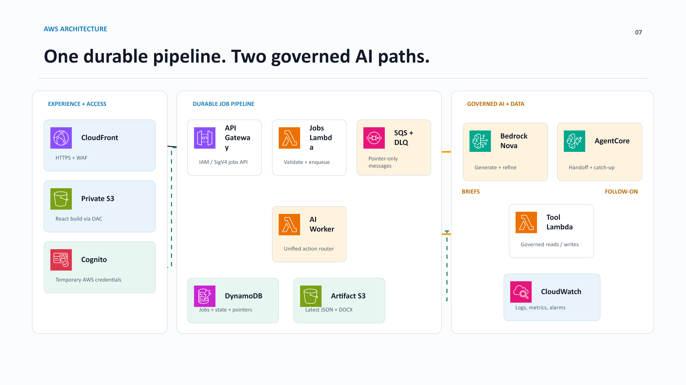

# PilarPrep

[](https://github.com/aadams35/Pilarprep/actions/workflows/ci.yml)

PilarPrep is an AWS-native GenAI workspace that turns scattered customer context into an actionable meeting brief, a role-aware pre-call handoff, and governed follow-on project context.

[Live demo](https://pilarprep.app) | [Deployment guide](DEPLOYMENT.md) | [Architecture](ARCHITECTURE.md) | [Security](SECURITY.md)

> The public demo uses synthetic customer scenarios. Do not upload customer recordings, personal data, secrets, or confidential material.

## Why PilarPrep

Sales and Solutions Architects often enter customer meetings with context split across notes, stakeholder profiles, technical assumptions, and business objectives. That creates duplicated preparation, inconsistent discovery, and weak handoffs after the call.

PilarPrep creates one governed workflow:

1. Capture customer, meeting, stakeholder, company-value, and AWS priority context.
2. Generate business, technical, executive, stakeholder, game-plan, and objection briefs.
3. Refine one selected brief without changing unrelated sections.
4. Approve the packet and prepare a role-aware pre-call handoff.
5. Upload a synthetic meeting recording, transcribe it, and compare it with the approved packet.
6. Require human review before meeting-derived changes become project truth.
7. Produce a follow-on handoff and catch-up view for Sales, SAs, PMs, executives, delivery teams, and new project members.

## Architecture



The application is serverless and event-driven. A private S3 origin serves the React application through CloudFront. Browser requests use Cognito credentials and AWS Signature Version 4. API Gateway accepts scoped jobs, SQS buffers work, and a unified Lambda worker routes generation to Amazon Bedrock or governed handoff and catch-up actions to AgentCore. DynamoDB stores state and version locks; S3 stores approved artifacts and meeting evidence.

### AWS services

| Layer | AWS services | Responsibility |
| --- | --- | --- |
| Web | CloudFront, private S3, WAF | HTTPS delivery, origin protection, caching, and rate controls |
| Identity | Cognito, IAM | Temporary guest credentials, authenticated workspaces, and least-privilege API access |
| API and jobs | API Gateway, Lambda, SQS, DLQ | Validation, asynchronous processing, retries, and job status |
| GenAI | Amazon Bedrock, Guardrails, AgentCore, Strands | Brief generation, governed tools, memory, handoff, and catch-up |
| Retrieval | Bedrock Knowledge Bases, S3 Vectors | Grounded Blue Mesa evidence retrieval |
| Data | DynamoDB, private S3 | Project state, idempotency, approval metadata, JSON, DOCX, and audio evidence |
| Operations | CloudWatch, X-Ray, SNS, AWS Budgets | Logs, metrics, traces, alerts, and cost visibility |

## Key capabilities

- Customer-specific business, technical, and executive briefing
- Ranked AWS Well-Architected priorities
- Decision-maker and stakeholder influence profiles
- Isolated per-tab refinement with contradiction checks
- Bedrock model routing between Nova Pro, Nova Micro, and Claude Sonnet
- Guardrailed prompts and validated structured responses
- SQS-backed asynchronous processing with idempotency and a DLQ
- AgentCore and Strands handoff and catch-up workflows
- Agentic RAG grounded in approved synthetic evidence
- Human-reviewed meeting intelligence using Amazon Transcribe
- Latest packet retrieval plus versioned approved JSON and DOCX artifacts
- IAM-scoped guest demo and Cognito user-pool workspace paths

## Repository structure

```text
PilarPrep/
|-- frontend/                 # React/Vite application and browser AWS clients
|   |-- app/                  # Pages, workflow UI, and API adapter
|   |-- lib/pillarprep/       # Domain types, signing, polling, and refinement logic
|   |-- public/               # Static product and AWS service assets
|   |-- static/               # AWS static-build entry point
|   `-- README.md             # Frontend development notes
|-- backend/                  # Python serverless and AgentCore services
|   |-- generation/           # Shared brief generation boundary
|   |-- jobs_pipeline/        # Jobs API, SQS worker, meeting and evidence flows
|   |-- agentcore/            # Runtime, memory, gateway tools, and contracts
|   |-- bedrock_lambda/       # Core resources and retained compatibility path
|   `-- frontend_static/      # CloudFront and private S3 infrastructure
|-- infrastructure/          # Stack inventory and deployment order
|-- data/                     # Synthetic scenarios, RAG evidence, and eval rubrics
|-- demo-assets/              # Synthetic audio used by the bounded demo
|-- scripts/                  # Deployment, smoke-test, and data-preparation commands
|-- tests/                    # Frontend unit and browser workflow tests
|-- evals/                    # Brief quality evaluation harness
|-- docs/                     # Architecture, security, operations, and presentation material
|-- DEPLOYMENT.md             # Concise deployment entry point
|-- ARCHITECTURE.md           # System design summary
|-- SECURITY.md               # Security policy and demo boundaries
`-- package.json              # Stable root commands for development and verification
```

The root commands remain stable even though the browser source now lives under `frontend/`.

## Quick start

### Prerequisites

- Node.js 22 or newer
- Python 3.12 or newer
- AWS CLI v2 and AWS SAM CLI for AWS deployment
- An AWS profile that assumes a least-privilege deployment role

### Local application

```powershell
npm ci
npm run dev -- --host 127.0.0.1 --port 3002
```

Open `http://127.0.0.1:3002`.

The local application can render deterministic development output. Hosted failures do not silently return demo content.

## Verification

```powershell
npm run lint
npm test
npm run pipeline:test
npm run agentcore:test
npm run lambda:test
npm run test:e2e
npm run eval:briefs
```

Run the complete gate with:

```powershell
npm run verify:demo
```

## AWS deployment

PilarPrep deploys as a small set of CloudFormation stacks so each ownership boundary can be changed and rolled back independently.

```powershell
.\scripts\deploy-aws-backend.ps1 -Region us-east-1
.\scripts\deploy-jobs-pipeline.ps1 -Region us-east-1 -Profile pillarprep-deployer
.\scripts\deploy-agentcore.ps1 -Region us-east-1 -Profile pillarprep-deployer
.\scripts\deploy-aws-frontend.ps1 -Region us-east-1
```

Read [DEPLOYMENT.md](DEPLOYMENT.md) before deploying. Never deploy with AWS account root credentials.

## Security model

- Frontend S3 public access is blocked; CloudFront uses Origin Access Control.
- Production traffic is HTTPS-only.
- Browser API requests are IAM-authorized and signed with temporary credentials.
- Server-side scope is derived from the caller, not trusted from browser tenant fields.
- SQS messages contain routing and object pointers rather than full customer packets.
- Private S3 stores artifacts and meeting audio with scoped access.
- DynamoDB conditional writes protect versions, approvals, and idempotency.
- Bedrock Guardrails and deterministic validation protect model inputs and outputs.
- Meeting-derived changes require explicit human review.

See [SECURITY.md](SECURITY.md) and [docs/security-and-tenancy.md](docs/security-and-tenancy.md).

## Documentation

Start with [docs/README.md](docs/README.md). It separates architecture, deployment, operations, security, GenAI design, and presentation material so new contributors do not have to search the entire repository.

## Project status

PilarPrep is a portfolio and demonstration project. The public environment is intentionally bounded, uses synthetic data, and is not a production system of record. Production recommendations are tracked in [docs/production-roadmap.md](docs/production-roadmap.md).
