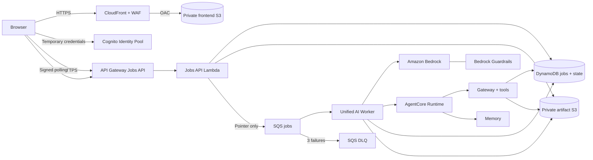
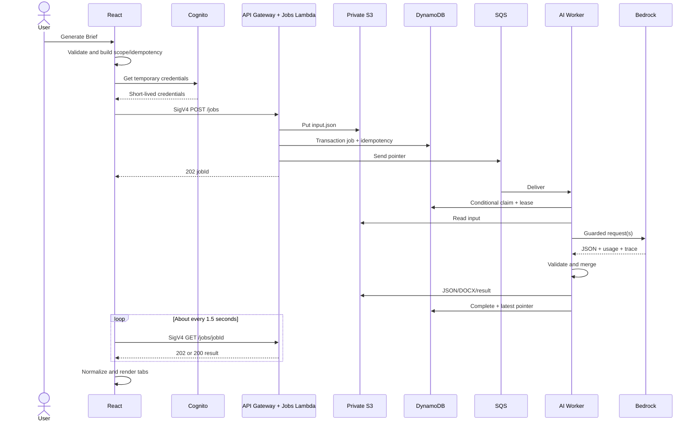
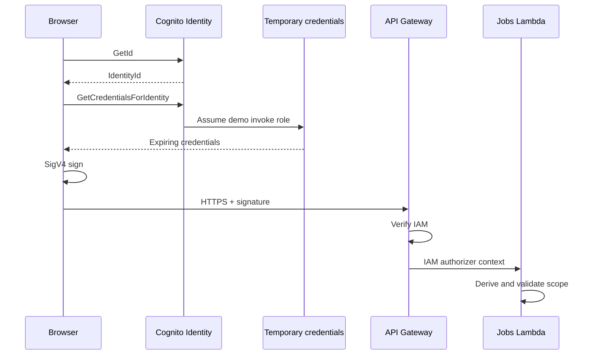
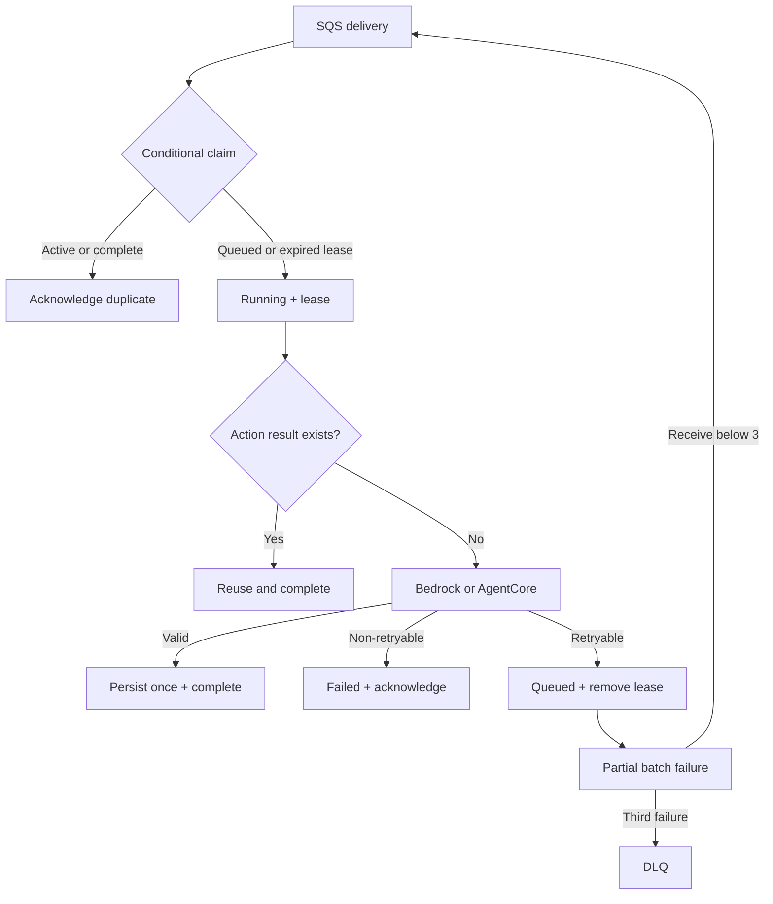
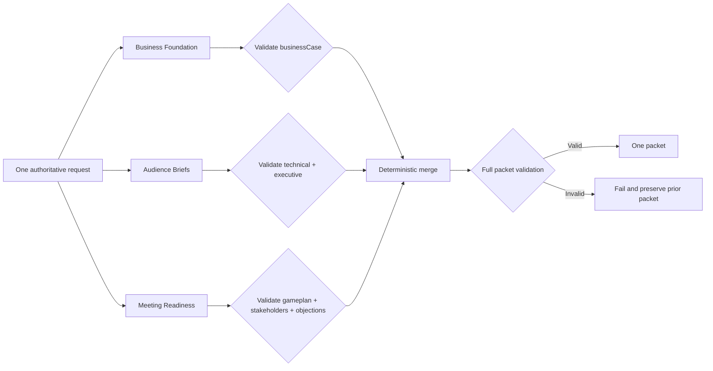
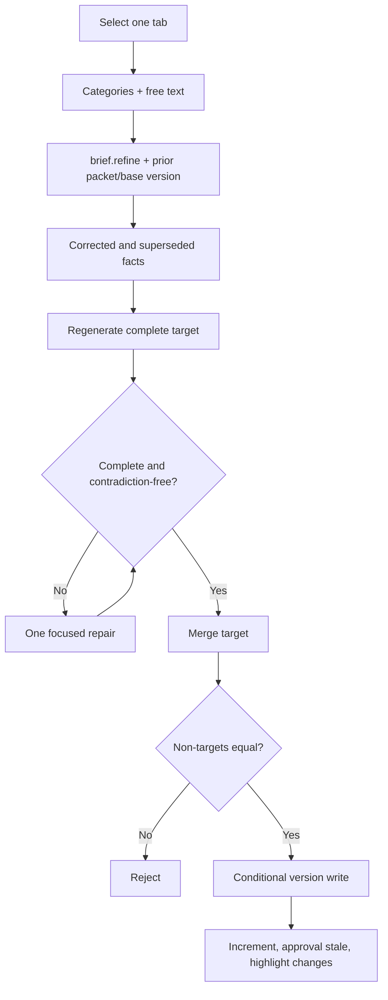
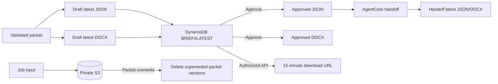
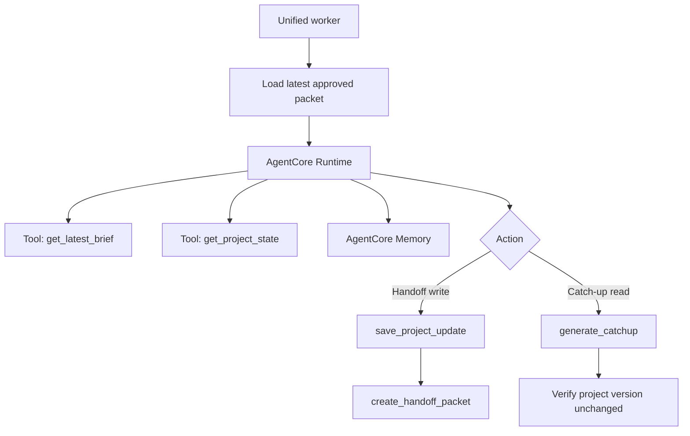

# PilarPrep: From Generate Brief to Stored Packet

Verified against the PilarPrep repository and live us-east-1 deployment on 2026-08-21. Read-only AWS checks used the configured PilarPrep deployment role. No application or AWS resources were changed.

## Evidence labels

- **Verified**: confirmed in source, IaC, tests, or live AWS.
- **Inferred**: reasonable conclusion not directly proved in this pass.
- **Recommended**: future improvement, not current behavior.

## 1. Plain-English overview

**Verified.** PilarPrep is a serverless, asynchronous briefing workflow. A user supplies customer and meeting context in React. The browser gets short-lived AWS credentials, signs an HTTPS request, and submits one job to an IAM-protected API. The API validates and scopes the request, stores the complete input in private S3, creates status and idempotency records in DynamoDB, and puts a small S3-pointer message on SQS. A Lambda worker claims the job, invokes the selected Amazon Bedrock model with Guardrails, validates the response, creates JSON and DOCX artifacts, and marks the job complete. The browser polls for the result and displays one packet across the briefing tabs.

Claude Sonnet 4.6 uses three internal section routes so each response has a smaller schema. The frontend still submits one job and receives one packet.

| Concept | Owner | Location |
|---|---|---|
| Foundation model | AWS/model provider | Managed by Bedrock; not stored in PilarPrep S3 |
| Prompt/model configuration | PilarPrep | Python source and Lambda environment |
| Customer context/job input | PilarPrep | Private S3 plus scoped DynamoDB metadata |
| Generated packets | PilarPrep | Private S3 JSON/DOCX plus DynamoDB pointers |
| Project state/memory | PilarPrep | DynamoDB and AgentCore Memory |

## 2. Thirty-second explanation

> PilarPrep turns sales discovery into an SA-ready packet without holding a browser connection open during a long AI call. React signs a job request with temporary Cognito credentials. API Gateway and Lambda validate identity and customer scope, store the input in private S3, and queue a pointer in SQS. A unified Lambda worker calls the selected Bedrock model with Guardrails, validates the output, and saves the latest JSON and DOCX packet. DynamoDB tracks the job, version and approval state while the browser polls. After approval, AgentCore uses governed tools and project memory for handoff and role-aware catch-up.

## 3. Two-minute explanation

**Verified.** CloudFront serves React over HTTPS from a private S3 REST origin using Origin Access Control. A public demo visitor does not enter a password, but the browser still receives temporary credentials from an unauthenticated Cognito Identity Pool. Those credentials assume a limited IAM role and sign every Jobs API request with SigV4.

When the user clicks **Generate Brief**, React validates the form, derives client/project identifiers, reuses a browser session ID, creates a one-time idempotency key, and sends POST /jobs. The Jobs API validates again, derives scope from API Gateway IAM context, enforces demo-client and session limits, writes the full input to private S3, transactionally creates job/idempotency records in DynamoDB, and sends only routing metadata plus an S3 pointer to SQS. It returns 202 Accepted.

SQS invokes one Python 3.12 worker. A conditional DynamoDB update grants one delivery the processing lease. The worker retrieves the authoritative input, resolves the model, builds the prompt, includes Guardrail ID/version in the Bedrock Converse request, validates output, and persists latest.json/latest.docx. Claude is split internally into Business Foundation, Audience Briefs and Meeting Readiness routes to avoid incomplete JSON from output-token exhaustion.

The browser signs GET /jobs/{jobId} about every 1.5 seconds, with a 12-minute client timeout. Completion fills the Business Case, Technical, Executive, Stakeholder, Game Plan and Objection tabs. Refinement regenerates only the active tab and makes approval stale. AgentCore later uses the approved server-side packet for handoff and catch-up.

## 4. Complete click-to-packet walkthrough

### 4.1 Frontend

**Verified.** requestBrief() blocks a duplicate click, determines generation/refinement/handoff, builds a BriefRequest, validates it, sanitizes the company into clientId/projectId, reuses a local browser session ID, creates a new idempotency key, and enters scoped loading state. A new packet clears stale output; refinement/handoff preserves the current packet.

Inputs include company, industry, meeting type, size, context, company values and URL, additional direction, notes, ranked pillars, people and model preference.

Sources: frontend/app/page.tsx:2140-2250, frontend/app/page.tsx:2387-2610, frontend/lib/pillarprep/generator.ts:746.

**Why a job?** Bedrock duration is variable. SQS decouples acceptance from inference, enables controlled concurrency/retry, and lets API Gateway return quickly.

### 4.2 Credentials and SigV4

**Verified.** The browser calls Cognito Identity GetId then GetCredentialsForIdentity. Credentials are cached until one minute before expiration. Smithy SignatureV4 signs the exact execute-api method, URL, query, headers and body.

Source: frontend/lib/pillarprep/aws-sigv4.ts:1-166.

### 4.3 POST /jobs

Representative envelope:

```json
{
  "action": "brief.generate",
  "clientId": "peakcart-retail",
  "projectId": "peakcart-retail",
  "sessionId": "session-<uuid>",
  "idempotencyKey": "brief-generate-<uuid>",
  "input": {
    "company": "PeakCart Retail",
    "modelPreference": "claude-sonnet-4.6",
    "additionalDirection": "The solution must interface with payroll"
  }
}
```

**Verified.** The API derives its own trace ID. It verifies HTTPS/origin, derives server-side scope, validates action/IDs/model/schema, applies session quota, checks idempotency, writes full input to jobs/<tenant>/<client>/<project>/<job>/input.json with SSE-S3, transactionally writes JOB and IDEMPOTENCY items, sends a pointer-only queue message, and returns 202 with jobId and pollAfterMs=1500.

Sources: backend/jobs_pipeline/api.py:145-327, backend/jobs_pipeline/common.py:181-330, backend/jobs_pipeline/common.py:369-529.

### 4.4 SQS package and worker

**Verified.** SQS contains action, job ID, scope, trace ID, input version and S3 key, not full customer context. This keeps messages small and reduces exposure in queue tooling.

The worker parses the message, conditionally claims queued->running, sets a 660-second lease, loads/revalidates the S3 input, checks action idempotency, resolves the model, builds the prompt, invokes Bedrock/AgentCore, validates/repairs, persists, and conditionally completes the job.

| Action | Engine | State effect |
|---|---|---|
| brief.generate | Direct Bedrock | New draft/latest metadata |
| brief.refine | Direct Bedrock | New target draft; approval stale |
| brief.approve | Worker persistence | Durable approval |
| handoff.generate | AgentCore | Writes project state/handoff |
| catchup.generate | AgentCore | Read-only |
| meeting.process | Transcribe + analysis | Review proposal |
| meeting.approve | Reviewed persistence | Applies approved state |

Sources: backend/jobs_pipeline/worker.py:147-475, backend/jobs_pipeline/worker.py:720-855, backend/jobs_pipeline/worker.py:1316-1455.

### 4.5 Completion

**Verified.** Worker stores the result, writes action idempotency and changes the job to complete. Signed polling is restricted by owner, browser session, client and project. Running returns 202; completion returns 200 plus the S3-backed result. React rejects mismatched scope, unknown state, fallback output or wrong provider.

Sources: backend/jobs_pipeline/api.py:330-434, frontend/lib/pillarprep/jobs-client.ts:20-150, frontend/app/page.tsx:2199-2250.

## 5. Service-by-service responsibilities

| Service | Responsibility | Verified configuration |
|---|---|---|
| CloudFront | Public delivery/security edge | HTTPS redirect, OAC, WAF, headers |
| Frontend S3 | React assets | Private; Public Access Block |
| Cognito Identity | Temporary demo identity | Unauthenticated on; classic flow off |
| IAM | Authorization boundaries | Separate browser/API/worker/tool roles |
| API Gateway HTTP API | Jobs contract | Five AWS_IAM routes |
| Jobs API Lambda | Validate, scope, queue, poll, list, download | 15 seconds |
| Artifact S3 | Inputs/results/JSON/DOCX | Private, versioned, SSE-S3 |
| DynamoDB | Jobs, idempotency, approval, state | One on-demand table, TTL, PITR |
| SQS/DLQ | Buffer/retry/isolation | Encrypted, max receive 3 |
| AI Worker | Bedrock/AgentCore orchestration | Python 3.12, 1024 MB, 600s |
| Bedrock | Managed model inference | Nova default; Micro/Claude allowed |
| Guardrails | Policy evaluation | ID 4n4bcsibf83u, version 2 |
| AgentCore | Governed handoff/catch-up | Runtime, Gateway, Memory, tools |
| Knowledge Base | Approved evidence retrieval | Blue Mesa demo |
| CloudWatch | Logs/metrics/alarms | Three operational dashboards |
| AWS Budgets | Spend alert | Alert, not hard cutoff |

## 6. Authentication and IAM

1. Browser downloads static files from CloudFront.
2. Browser calls Cognito Identity Pool us-east-1:51a31152-80e4-453f-b17e-5077109376fa.
3. Cognito issues short-lived credentials for pillarprep-demo-demo-api-invoke-role.
4. Trust policy restricts assumption to this pool.
5. Browser signs with SigV4.
6. API Gateway verifies signature and execute-api permission.
7. Lambda derives hashed user identity and enforces client scope.
8. Every poll/artifact request repeats authorization.

**Verified.** The browser cannot directly invoke Bedrock/Lambda/AgentCore or read DynamoDB/S3. An artifact request goes through the API, which returns an object-specific 15-minute presigned URL.

**Cross-client isolation:** server-derived scope drives DynamoDB keys and S3 prefixes. Job reads match owner/session/client/project. Stored artifact keys must begin with the authorized project prefix. Demo identities are limited to five configured client IDs.

**Why not API keys?** A browser API key is a visible shared secret. Temporary IAM credentials expire and are role-scoped. They still are not named-user login.

**Production gap.** Anonymous Cognito identifies a browser, not a person. Production needs User Pools or OIDC/SAML, claims, server-side entitlements, revocation and named audit records.

## 7. Jobs API and queue

**Verified table design:** one table with partition key projectId and sort key sortKey.

| Item | Sort key | Purpose |
|---|---|---|
| Job | JOB#<jobId> | Status, scope, pointers, retries, lease, TTL |
| Job idempotency | IDEMPOTENCY#JOB#<key> | Repeat submission -> same job |
| Action idempotency | Action-specific key | Prevent repeat side effects |
| Latest brief | BRIEF#LATEST | Draft/approved pointers/version |
| Latest handoff | HANDOFF#LATEST | Handoff pointers/source version |
| Project state | PROJECT#STATE | Decisions, risks, actions |
| Client directory | CLIENT#<client> | Authorized catch-up listing |

Lifecycle is queued -> running -> complete. Retryable failures return queued; non-retryable/final failures become failed. Conditional writes prevent simultaneous ownership and stale overwrite.

**Verified SQS:** Standard queue pillarprep-demo-ai-jobs, SSE-SQS, 20-second long polling, one-day retention, batch 1, partial batch failure, worker concurrency 2, visibility 3600 seconds, max receives 3, DLQ retention 14 days. Worker timeout is 600 seconds and lease 660 seconds. Ordinary exceptions reset queued, remove lease and request a 5-second retry.

**Duplicate prevention:** conditional claim, action idempotency lookup and conditional version writes. A completed/actively leased duplicate is acknowledged without repeating side effects.

**Recommended:** reduce the 60-minute visibility/11-minute lease mismatch or implement visibility heartbeat. A hard timeout cannot run cleanup and can delay redelivery.
## 8. Worker and Bedrock generation

### Model selection

| UI choice | Bedrock ID | Current profile |
|---|---|---|
| Nova Pro | us.amazon.nova-pro-v1:0 | 4200 max tokens, temperature 0.1, top-p 0.7, optimized latency |
| Nova Micro | us.amazon.nova-micro-v1:0 | 3200 max tokens, temperature 0.1, top-p 0.7 |
| Claude Sonnet 4.6 | global.anthropic.claude-sonnet-4-6 | 2500 max tokens per route, temperature 0.1 |

**Verified.** Nova Pro is default. BEDROCK_ALLOWED_MODEL_IDS blocks arbitrary model IDs. PilarPrep stores model selection/ID, prompt configuration, inputs, outputs, usage, version and approval status. Bedrock manages the foundation model itself.

Sources: backend/bedrock_lambda/app.py:21-140, backend/jobs_pipeline/template.yaml:807-859.

### Prompt and grounding

**Verified.** The prompt incorporates company/industry, meeting type/size, customer context, company values/URL notes, additional direction, meeting notes, pillar ranking, decision-makers/stakeholders, feedback and previous packet. It separates confirmed facts, assumptions, unknowns and discovery questions. Refinement identifies corrected/superseded facts.

For "interface with payroll," the prompt requires payroll data flow, ownership, privacy/compliance, cutover/reconciliation, outcomes, scope, risks, questions, technical implications and objections. A deterministic term check recognizes payroll and approved synonyms. Missing coverage triggers one focused repair.

### Bedrock Guardrails

**Verified.** The worker includes Guardrail ID/version and trace inside the Bedrock Converse request. Lambda does not call a separate public guardrail service before the model. Bedrock evaluates the guarded request/response and returns stop/trace data.

Guardrails reduce disallowed-content risk. They do not prove facts, authorize clients, stop every prompt injection or replace schema/contradiction checks.

Sources: backend/bedrock_lambda/app.py:877-1028, backend/bedrock_lambda/template.yaml:368-372.

## 9. Claude section router

**Verified purpose.** A monolithic long packet can reach the output limit and return truncated/unclosed JSON. A longer Lambda timeout cannot repair token exhaustion. The router narrows each schema:

| Route | Allowed sections |
|---|---|
| Business Foundation | Business Case |
| Audience Briefs | Technical and Executive |
| Meeting Readiness | Game Plan, Stakeholders and Objections |

Every route receives the same authoritative request and route-specific schema. Routes run sequentially today. Each is independently checked for expected sections and prohibited extras. Invalid/truncated output receives a focused retry. Citations are de-duplicated, sections are deterministically merged, and the final packet is validated again.

Metadata records strategy, route, expected sections, attempts, tokens, latency, model, stop reason and guardrail trace. React still sees one job and one packet.

**Tradeoff:** sequential routes simplify control and protect quotas but make latency additive. Controlled parallelism is a future option after load/quota testing.

Sources: backend/bedrock_lambda/app.py:96-106, backend/bedrock_lambda/app.py:1152-1248, backend/bedrock_lambda/app.py:3320-3325.

## 10. Validation and refinement

**Verified output checks:**

- Bedrock provider and no deterministic fallback.
- One complete JSON object.
- Required route/packet sections.
- Thirteen Business Case fields, field minimums and 500 total words.
- Required four-passage structures and actual Ask: questions.
- Objection structure and customer-specific content.
- Additional-direction coverage and citation allowlist.
- Contradiction detection.
- Complete selected refinement target.
- No unauthorized cross-tab changes.

| Problem | Current behavior |
|---|---|
| max_tokens | Concise complete-schema retry |
| Guardrail intervention | Neutral-business retry through same guardrail |
| Invalid JSON | Focused JSON retry |
| Incomplete target | Target-specific repair |
| Contradiction | Repair using authoritative facts |
| Ignored direction | Salient-term repair |
| Still invalid | Fail and preserve previous packet |
| Wrong provider/fallback | Reject result |

### Refinement

**Verified.** Refinement sends active refinementTarget, feedback categories/free text, previous packet and baseBriefVersion. It regenerates the entire selected target. Server-side merge preserves every other tab. A conditional DynamoDB write requires the current version to match the submitted base. Success increments the packet version and changes approval to stale.

Example: feedback confirms the customer already operates on AWS. Refining Business Case must remove initial/on-prem migration assumptions from scenario, current situation, outcomes, scope, risks, assumptions, questions and next steps. Technical remains unchanged until separately refined. React also compares packet versions and highlights changed passages.

Sources: frontend/app/page.tsx:2387-2585, backend/bedrock_lambda/app.py:1879-2091, backend/bedrock_lambda/app.py:3024-3275.

## 11. Persistence and frontend rendering

| Data | Location | Meaning |
|---|---|---|
| Job input | jobs/<tenant>/<client>/<project>/<job>/input.json | Authoritative request |
| Job result | Private S3 result | Polling result |
| Draft brief | project brief/draft/latest.json/.docx | Latest draft |
| Approved brief | Approved project prefix | Handoff/catch-up source |
| Handoff | project handoff/latest.json/.docx | Latest implementation packet |
| Project state | DynamoDB PROJECT#STATE | Versioned operational context |
| Catch-up | Job result only | Read-only response |
| Agent memory | AgentCore Memory | Session context, not source packet |

**Verified latest-only behavior.** Packet writes use fixed latest.json/latest.docx keys. S3 versioning creates new versions; application code then deletes noncurrent versions under that packet prefix, retaining the new pair. Temporary job objects are separate. DynamoDB job TTL is enabled. An S3 lifecycle for all job objects was not verified and should be added/confirmed.

DOCX names are <Client> - Brief - v<N>.docx or <Client> - Handoff - v<N>.docx. The authorized API returns a 15-minute presigned URL.

**Verified polling.** Accepted jobs suggest 1500 ms; React clamps between 750 ms and 5 seconds. Every poll is signed. The 12-minute timeout cancels polling and preserves current content. New generation clears stale output; refinement/handoff leaves current content readable. Completion replaces "No brief generated yet" and fills tabs.

Sources: backend/jobs_pipeline/api.py:435-621, backend/jobs_pipeline/worker.py:235-443, frontend/lib/pillarprep/jobs-client.ts:20-150.

## 12. Failure handling

| Scenario | Detection | User/retry behavior | Preservation/operator action |
|---|---|---|---|
| Invalid form | React | Inline error; no job | Packet preserved |
| Unsigned request | API Gateway | 403 | Check Cognito/SigV4 |
| Unauthorized client | Scope validator | Safe 403 | Check allowlist/claims |
| Duplicate click | React ref | Ignored | First job continues |
| Reused idempotency | API/DynamoDB | Existing job | No second enqueue |
| Duplicate SQS | Claim/idempotency | Acknowledged/reused | No duplicate side effect |
| Missing S3 input | Worker | Retry then fail | Check key/log/DLQ |
| Lambda exception | Worker | Queue retry | Check errorType/log |
| Hard timeout | Lambda/lease | Delayed retry possible | Check duration/lease/age |
| Bedrock throttle | SDK | SQS retry | Check quota/log |
| Guardrail intervene | Bedrock | One repair | Check trace summary |
| Invalid JSON | Validator | One repair | Prior packet preserved |
| Wrong route output | Route validator | Reject/repair | Never merged |
| Stale version | DynamoDB condition | Reload | Newer packet preserved |
| S3 write failure | Worker | Retry/fail | Latest pointer not completed |
| Browser timeout | Poller | 12-minute message | Server may continue |
| DLQ arrival | SQS | No auto replay | Diagnose before redrive |

Do not blindly redrive. Locate job/trace, fix root cause, verify idempotency, then use controlled redrive or submit a new job.

## 13. Handoff and catch-up

**Verified.** Both enter the same Jobs API/SQS/worker path, then invoke AgentCore. Worker loads BRIEF#LATEST and the approved S3 packet. Handoff requires current approval and exact expected version. Catch-up uses latest approved server-side data, not stale browser data.

AgentCore retrieves latest approved brief and project state through governed tools. Catch-up builds role/focus context and is read-only; worker compares project version before/after. Handoff performs optimistic save_project_update and create_handoff_packet.

AgentCore adds governed tools, scoped retrieval, memory, citation enforcement, optimistic writes and auditable read-versus-write behavior beyond a direct Bedrock call.

Sources: backend/jobs_pipeline/worker.py:720-855, backend/agentcore/runtime/service.py:850-1035, backend/agentcore/tools/app.py:429-520.

## 14. Security review

### Strengths

- **Verified:** HTTPS redirect, private S3 origin and OAC.
- **Verified:** Frontend/artifact buckets block public access.
- **Verified:** Every Jobs route uses IAM.
- **Verified:** CORS allows only custom/CloudFront HTTPS origins.
- **Verified:** WAF is attached to CloudFront.
- **Verified:** Temporary browser credentials; no static API key.
- **Verified:** Separate least-privilege roles and server-side scope.
- **Verified:** SSE-SQS, SSE-S3 and TLS.
- **Verified:** Schema/model validation, Guardrails and output checks.

### Demo compromises

- **Verified:** Cognito identities are anonymous.
- **Verified:** Default execute-api endpoint is enabled.
- **Verified:** Client allowlist is static.
- **Verified:** S3 uses SSE-S3; no customer-managed key verified.
- **Inferred:** CloudFront WAF does not cover execute-api hostname.
- **Verified:** An unexpired presigned URL grants that exact object.
- **Verified:** Meeting processing is synthetic Blue Mesa only.

### Production priorities

1. Named User Pool or enterprise OIDC/SAML.
2. Claims plus server-side client entitlements.
3. Custom API domain, disable default endpoint, API WAF/resource policy.
4. KMS options and retention/deletion policy.
5. Named approval audit actor and CloudTrail strategy.
6. Stronger trust controls for arbitrary URLs/uploads.

## 15. Observability and troubleshooting

**Verified in code/IaC.** CloudWatch receives API/worker/AgentCore logs, Lambda duration/errors/throttles, SQS depth/age/DLQ metrics, and custom metrics for job status, idempotency, unauthorized requests, retries, duplicate delivery, validation, tokens/cost, route attempts and guardrail summaries. Trace IDs correlate API, job, queue and worker.

### "I clicked Generate, but no brief appeared"

1. Capture time, scenario, model, visible message and job ID.
2. Check current frontend bundle and browser Cognito/JavaScript errors.
3. Inspect POST /jobs: no call means frontend; 403 IAM/scope; 429 quota; 202 continue.
4. Find job/trace in API logs and DynamoDB.
5. Check SQS visible/in-flight/oldest age.
6. Search worker logs for claim, S3, Bedrock, validation, persistence or AgentCore error.
7. For running, compare lease, Lambda duration and queue visibility.
8. For failed, inspect error type/receive count and DLQ.
9. If complete, verify poll session/scope and result read.
10. If browser rejects, check provider/fallback/refinement isolation.
11. Repair before redrive.

## 16. Cost model

**Verified official price checked 2026-08-21.** Claude Sonnet 4.6 global on-demand is listed at $3.00 per million input tokens and $15.00 per million output tokens. Recheck before publication.

```text
cost = input_tokens / 1,000,000 * $3.00
     + output_tokens / 1,000,000 * $15.00
```

Three routes repeat context, so aggregate input is the sum:

```text
3 x 6,000 input tokens = 18,000 -> $0.054
5,000 output tokens              -> $0.075
Estimated model total            -> $0.129
```

A recent verified smoke test returned about 4,843 output tokens in about 119 seconds; output alone is about $0.073. A representative no-repair packet is roughly $0.10-$0.15 depending on aggregate input, not a guarantee. Repair adds cost. Selected-tab refinement is usually cheaper.

Serverless costs are small beside premium model output at demo volume. Controls include session quota, model allowlist, token ceilings, concurrency 2, WAF rate limits, alarms and AWS Budget. Budget alerts; it does not stop Bedrock.

Official sources:
- https://aws.amazon.com/marketplace/pp/prodview-o6w4hyizv7g64?applicationId=AWSMPContessa
- https://docs.aws.amazon.com/bedrock/latest/userguide/model-card-anthropic-claude-sonnet-4-6.html
- https://aws.amazon.com/bedrock/pricing/
## 17. Architecture and sequence diagrams

### Overall AWS architecture



### Generate Brief sequence



### Cognito and SigV4



### SQS, lease, retry and DLQ



### Claude section router



### Refinement



### Artifact lifecycle



### AgentCore handoff and catch-up


## 18. Likely AWS architect questions and answers

**Why API Gateway?** It provides the HTTPS contract, IAM authorization, CORS and routing. The browser never receives Lambda invocation permission.

**Why SQS?** Model latency is variable. SQS buffers bursts, caps concurrency, enables retry/DLQ and decouples acceptance from inference.

**How do you handle at-least-once delivery?** DynamoDB conditional claims, job/action idempotency and conditional version writes. SQS is transport, not source of truth.

**Why one DynamoDB table?** Access patterns are project-scoped point reads/queries and conditional updates. One table enables transactions across job/idempotency and avoids separate databases.

**Why S3 plus DynamoDB?** DynamoDB holds queryable state/pointers. S3 economically holds large input, JSON and DOCX objects.

**Where is the model?** Bedrock manages it. PilarPrep stores model ID/configuration, inputs, outputs and metadata, not weights.

**Why Bedrock instead of SageMaker AI?** The need is managed foundation-model inference, model choice, Guardrails and usage billing, not custom training/hosting.

**Why AgentCore?** Bedrock generates. AgentCore governs tool-based, memory-aware, source-checked read/write workflows for handoff and catch-up.

**Can users bypass CloudFront to S3?** Direct public access is blocked. Frontend uses OAC; artifacts require an authorized API call and short-lived presigned URL.

**How do Guardrails connect?** Guardrail ID/version are included in the Bedrock inference call. There is no browser-to-guardrail path.

**How are incomplete Claude outputs handled?** Three smaller routes, route validation, focused repair and final validation. Invalid output never replaces the previous packet.

**How is wrong-tab refinement prevented?** Server merges only the target and verifies non-target equality; frontend performs a second comparison.

**Largest reliability risk?** The 3600-second queue visibility is much longer than the 600-second worker and 660-second lease, delaying hard-timeout recovery.

**Largest security compromise?** Anonymous demo identities are not named users. Production needs login/federation and dynamic entitlements.

**Claude cost?** Aggregate input at $3/M plus output at $15/M using the checked price. Representative no-repair packet is roughly $0.10-$0.15.

## 19. Known gaps

1. **Verified:** Anonymous demo identity and static client allowlist.
2. **Verified:** Default execute-api endpoint enabled.
3. **Verified:** Queue visibility/worker lease mismatch.
4. **Verified:** Sequential Claude routes add latency.
5. **Verified:** RAG/meeting path limited to Blue Mesa synthetic evidence.
6. **Inferred:** Durable approval audit does not identify a named human.
7. **Verified:** SSE-S3, not verified customer-managed KMS.
8. **Inferred:** S3 lifecycle for temporary jobs needs explicit verification.
9. **Verified:** Legacy Brief/Agent APIs remain as compatibility/fallback while public workflow uses Jobs API.
10. **Recommended:** End-to-end canaries for generate/refine/approve/handoff/catch-up/download.

## 20. Production roadmap

### Identity and edge

1. Named User Pool or enterprise OIDC/SAML.
2. Claims plus server-side tenant/client entitlements.
3. Custom API domain, disable default endpoint, API WAF/resource policy.
4. Per-user quotas, revocation and abuse detection.

### Reliability and governance

1. Align visibility/lease or implement heartbeat extension.
2. Controlled DLQ redrive with operator approval and idempotency.
3. S3 retention/lifecycle by data class.
4. KMS options, CloudTrail data events and tested deletion/offboarding.
5. Named immutable approval audit events.

### GenAI quality and performance

1. Automated evals for accuracy, contradiction, question quality and direction coverage.
2. Route-level latency/cost tests and safe controlled concurrency.
3. Tenant-owned RAG with source trust and permissions.
4. Explicit quality/cost model routing with no silent fallback.
5. Prompt caching where supported and justified.

### Operations

1. Synthetic canaries and SLOs.
2. Alarm runbooks, trace correlation and DLQ ownership.
3. Multi-account environments and CI/CD promotion.
4. Recovery and tenant-isolation tests.

## 21. Repository sources and verification notes

### Primary sources

- Frontend workflow: frontend/app/page.tsx:2140-2250, frontend/app/page.tsx:2387-2610
- Browser Cognito/SigV4: frontend/lib/pillarprep/aws-sigv4.ts:1-166
- Polling: frontend/lib/pillarprep/jobs-client.ts:20-150
- Frontend validation: frontend/lib/pillarprep/generator.ts:746
- Jobs acceptance/polling: backend/jobs_pipeline/api.py:145-434
- Client/latest/artifacts: backend/jobs_pipeline/api.py:435-621
- Scope/keys/validation: backend/jobs_pipeline/common.py:160-330, backend/jobs_pipeline/common.py:360-529
- Worker: backend/jobs_pipeline/worker.py:147-475, backend/jobs_pipeline/worker.py:720-855, backend/jobs_pipeline/worker.py:1080-1215, backend/jobs_pipeline/worker.py:1316-1455
- Jobs IaC: backend/jobs_pipeline/template.yaml:395-440, backend/jobs_pipeline/template.yaml:748-870
- Models/router: backend/bedrock_lambda/app.py:21-140, backend/bedrock_lambda/app.py:1152-1248
- Prompt/guardrails/validation: backend/bedrock_lambda/app.py:666-1028, backend/bedrock_lambda/app.py:2814-3341
- Identity/storage/guardrail IaC: backend/bedrock_lambda/template.yaml:128-240, backend/bedrock_lambda/template.yaml:570-729
- Frontend IaC: backend/frontend_static/template.yaml:78-281
- AgentCore: backend/agentcore/runtime/service.py:850-1035, backend/agentcore/tools/app.py:429-520, backend/agentcore/template.yaml:523-820

### Live verification

**Verified 2026-08-21:** pillarprep-bedrock, pillarprep-jobs, pillarprep-frontend and pillarprep-agentcore were UPDATE_COMPLETE in account 386807258431, us-east-1.

**Verified:** Jobs API kcod9pw1j7 is an HTTP API with five IAM routes. CORS permits only custom/CloudFront HTTPS origins. Default execute-api remains enabled.

**Verified:** pillarprep-demo-ai-worker is Python 3.12, 1024 MB, 600 seconds, last update successful, with expected models, Guardrail and AgentCore settings.

**Verified:** Queue visibility 3600 seconds, long polling 20, SSE-SQS, one-day retention, max receive 3, batch 1 and maximum concurrency 2.

**Verified:** DynamoDB TTL uses expiresAt and PITR is enabled for 35 days. Artifact S3 is versioned and blocks all public access.

**Verified:** Cognito unauthenticated identities are enabled and classic flow disabled. CloudFront redirects HTTP to HTTPS, uses OAC and has WAF attached.

### Verification limits

- No credentials, tokens, secret values, presigned signatures or customer data are included.
- No generation, deployment, redrive, deletion or configuration change was performed.
- Pricing is time-sensitive and was checked on the verification date.
- A specific run's packet metadata is the authoritative token/cost record.
