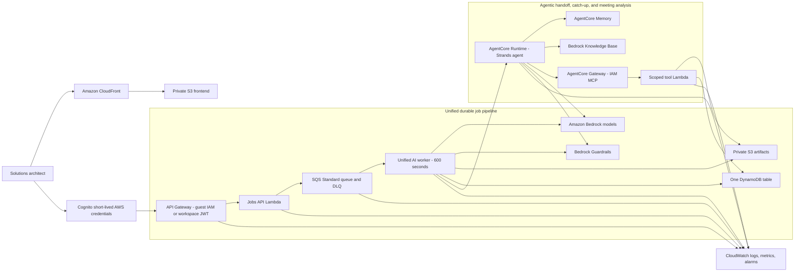

# PilarPrep AgentCore Architecture

Status: deployed and verified in the PilarPrep demo account.

## Unified job pipeline

## Two-minute explanation

PilarPrep now uses one durable asynchronous path. A guest IAM-signed request or authenticated workspace JWT reaches the Jobs API, which validates server-derived scope, stores large input in private S3, creates the one-table DynamoDB job record, and places a pointer-only message on SQS. One 600-second worker handles brief, refinement, handoff, catch-up, evidence, and meeting actions.

Brief generation and selected-tab refinement invoke Bedrock directly with Guardrails. Handoff, catch-up, and meeting analysis route from the same worker to AgentCore Runtime, where Strands can use scoped Knowledge Base retrieval, Memory, and five schema-constrained Gateway tools. Each tool validates a short-lived signed scope before reading an approved artifact or conditionally updating project state.

DynamoDB is the source of truth for jobs, approval pointers, decisions, risks, actions, owners, milestones, and open questions. S3 holds transient job payloads, drafts, immutable approved packet versions, and latest handoff artifacts. Bedrock owns the foundation models; PilarPrep stores model selection and prompts, not a model copy. AgentCore failures retry through SQS and fail visibly after bounded attempts rather than returning local demo content.

## Data ownership

| Concern | Owner | Scope |
| --- | --- | --- |
| Foundation model | Amazon Bedrock | Model ID selected per request; no customer model copy |
| Conversation continuity | AgentCore Memory | Tenant + client + project + session |
| Structured project state | DynamoDB | `TENANT#{tenant}|CLIENT#{client}|PROJECT#{project}` |
| Approved brief | Private S3 + DynamoDB pointer | `brief/approved/v{version}/packet.*` selected by `BRIEF#LATEST` |
| Handoff packet | Private S3 | `tenants/{tenant}/clients/{client}/projects/{project}/handoff/latest.*` |
| Prompt, policy, values, terminology | Versioned application configuration | Loaded separately from the model |

## Governed tools

| Tool | Access | Material effect |
| --- | --- | --- |
| `get_latest_brief` | Read | Returns only the authorized project's approved latest brief |
| `get_project_state` | Read | Returns the authoritative project registers |
| `save_project_update` | Write | Requires confirmation, idempotency key, schema validation, and expected version |
| `create_handoff_packet` | Write | Requires confirmation and replaces the project's latest JSON and DOCX |
| `generate_catchup` | Read | Organizes approved evidence for the requested audience role |

The model receives no general S3 or DynamoDB credentials. Only the tool Lambda owns those permissions.

## Isolation model

1. API Gateway accepts bounded guest routes through SigV4/IAM and workspace routes through Cognito JWT authorization.
2. The Jobs API derives `tenantId` and `userId` from verified identity context. Browser overrides are rejected.
3. JWT users must be assigned to the requested client/project; guest identities are restricted to the published synthetic scenarios.
4. The Jobs API stores an owner/session-bound job in the shared DynamoDB table, uploads large input to S3, and queues only scoped routing metadata.
5. The worker signs tenant, client, project, user, and session into a 10-minute HMAC scope token backed by Secrets Manager.
6. Every Gateway tool verifies the signature and exact project identifiers before constructing a DynamoDB key or S3 prefix.
7. Jobs API, worker, Runtime, Gateway, and tool roles have separate least-privilege policies and resource policies.

AgentCore no longer reads a legacy `brief/latest.json` key. The governed tool resolves `BRIEF#LATEST`, verifies the exact immutable versioned key, and fails closed when no approved packet exists.

## Reliability and audit behavior

- AgentCore consistently reads the exact approved artifact referenced by DynamoDB `BRIEF#LATEST` before model reasoning.
- Handoff creation fails closed if the browser-approved snapshot differs from the latest S3 brief, forcing a fresh review and approval.
- Model citations and every generated register source must match the exact allowlist built from approved evidence; invented source labels are rejected before any write.
- Project writes use a DynamoDB transaction with optimistic version checking and an idempotency record.
- Handoff retries are idempotent and return a fresh one-hour presigned DOCX URL.
- Approved brief JSON/DOCX pairs are immutable and versioned; only drafts and handoff latest pointers use replaceable current artifacts.
- Logs contain action, tool, tenant/client/project identifiers, trace ID, and error type; they exclude full briefs, credentials, and scope tokens.
- A known Strands protocol/JSON failure gets one bounded non-streaming Bedrock repair inside AgentCore with the same schema and Guardrail; other failures retry through SQS and remain visible.
- CloudWatch alarms cover Jobs API, worker, Runtime, and tool failures, and dashboards show sanitized events.

## Implementation map

| Path | Responsibility |
| --- | --- |
| `backend/agentcore/runtime/` | Strands agent, Bedrock model selection, Memory, and Gateway adapter |
| `backend/jobs_pipeline/worker.py` | Unified queue consumer, AgentCore invocation, approval, persistence, and retries |
| `backend/agentcore/tools/app.py` | Five validated data and artifact tools |
| `backend/agentcore/common/` | Contracts, identifiers, and signed scope token |
| `backend/agentcore/template.yaml` | Runtime, Memory, Gateway, IAM, API, Lambda, alarms, and dashboard |
| `backend/agentcore/events/` | BlueMesa handoff and second-request catch-up fixtures |
| `backend/agentcore/local_demo.py` | AWS-free end-to-end mock demonstration |
| `frontend/app/page.tsx` | Unified Jobs API UI for briefs, meeting review, handoff, and catch-up |

## Review notes

- AgentCore CloudFormation resources and direct-code deployment must be available in the target account and `us-east-1`.
- The unauthenticated Cognito identity is only for bounded synthetic demos. Private workspaces use the deployed User Pool; a pilot should add enterprise federation and managed tenant/client assignment.
- The signed scope token is an internal defense-in-depth mechanism. Rotate the Secrets Manager secret if it is ever exposed.
- The tool Lambda enforces tenant isolation in code because one execution role services multiple tenants. Production should add automated authorization tests to every release gate.
- No VPC is used because all dependencies are AWS public endpoints and a NAT Gateway would add idle cost without improving this demo's boundary.
