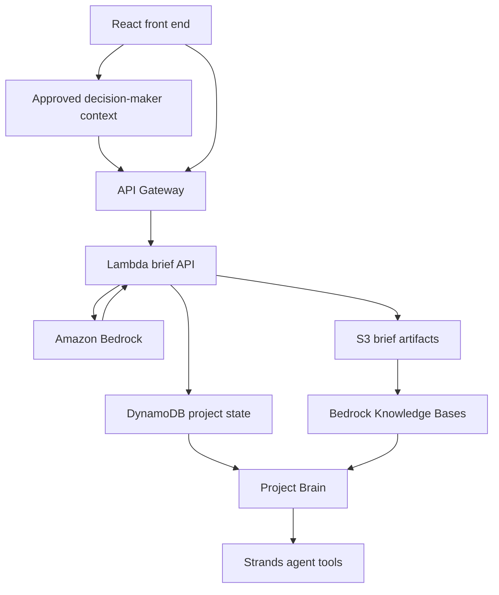

# AWS Architecture

PillarPrep is designed as a small AWS-native workload with a clear upgrade path from demo mode to production mode.

## Runtime Flow

1. The user enters company, industry, meeting type, size, pillars, context, and approved decision-maker notes.
2. The app posts the request to `/api/brief`.
3. In demo mode, the local generator returns deterministic structured output.
4. In AWS mode, `/api/brief` forwards the request to API Gateway and Lambda.
5. Lambda invokes Bedrock and normalizes the structured JSON.
6. Lambda stores the generated brief in S3 and writes project state to DynamoDB.
7. Approved briefs, decision-maker context, and meeting notes become grounding material for Project Brain.
8. Strands becomes the optional Phase 2 agent layer for tool-using follow-up and stakeholder mapping.

## Hackathon Talking Point

The important design choice is that the AI contract is stable before the model provider is swapped. The public demo can run safely without credentials, while the AWS backend uses the same request and response shape.
