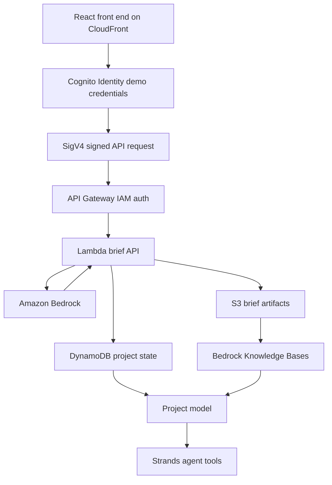

# AWS Architecture

PillarPrep is designed as a small AWS-native workload with a clear upgrade path from demo mode to production mode.

## Runtime Flow

1. The user enters company, industry, meeting type, size, ranked Well-Architected pillars, context, and approved decision-maker notes.
2. The app can generate a deterministic local demo or call the AWS model path.
3. In AWS mode, the browser gets short-lived Cognito Identity credentials for the limited demo role.
4. The browser SigV4-signs the API Gateway request.
5. API Gateway enforces IAM authorization and invokes Lambda.
6. Lambda invokes Bedrock and normalizes the structured JSON.
7. Lambda stores the generated brief in S3 and writes project state to DynamoDB.
8. Approved briefs, decision-maker context, and meeting notes become grounding material for Project model.
9. Strands becomes the optional Phase 2 agent layer for tool-using follow-up and stakeholder mapping.

## Hackathon Talking Point

The important design choice is that the AI contract is stable before the model provider is swapped. The public demo can be shared without a browser API key, while the live AWS path still uses IAM authorization, Lambda-side Bedrock access, S3 evidence, DynamoDB state, and a daily budget guardrail.
