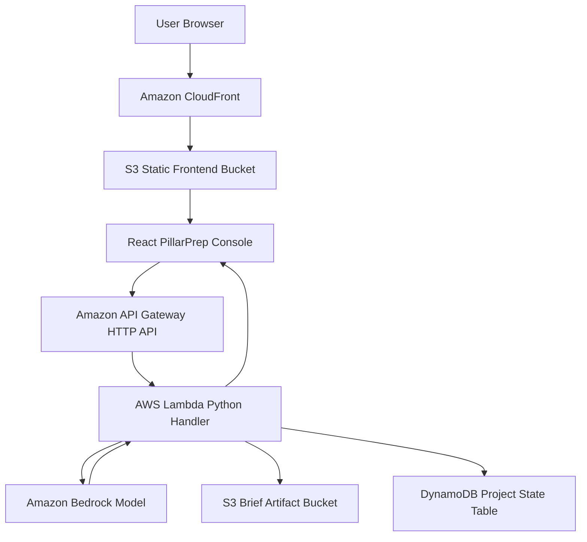

# PillarPrep AWS Infrastructure Design

This is the current deployment target for the hackathon frontend and backend. The goal is a working AWS-native demo path first, then deeper production hardening.

## Phase 1 AWS Stack



## Current Frontend Mode

The AWS-hosted frontend is deployed to S3 + CloudFront and currently runs in browser-only demo mode. It does not call `/api/brief`, API Gateway, Lambda, or Bedrock from the public bundle. AI model mode is available through the server-backed local Next.js route so the API key stays private.

Current frontend URL:

```text
https://d2e0btay0ynyf.cloudfront.net
```

## Request Flow With Models Enabled

1. The user enters customer context, Well-Architected pillar priorities, decision-maker notes, and meeting notes.
2. The frontend posts the structured request to `/api/brief` or a configured API Gateway endpoint.
3. In local demo mode, the frontend API route uses the deterministic demo generator.
4. In AWS model mode, the frontend route forwards the same request to API Gateway.
5. API Gateway invokes the Lambda handler.
6. Lambda builds the Bedrock prompt contract and invokes the configured model.
7. Lambda normalizes the model JSON and stores the request/response artifact in S3.
8. Lambda writes project state metadata to DynamoDB.
9. The frontend receives technical brief, executive brief, stakeholder lens, game plan, objections, Project Brain answer, and Phase 2 artifacts.

## Model And Storage Boundary

PillarPrep does not store a copy of the Bedrock foundation model. The configured model ID, currently `us.amazon.nova-micro-v1:0`, is passed to Bedrock at invocation time and AWS manages the model weights, serving layer, and model lifecycle.

Stored by PillarPrep:

- Lambda code stores the prompt contract, schema instructions, and structured fallback behavior.
- S3 stores generated brief artifacts as JSON documents containing the request, response, timestamp, provider, and project metadata.
- DynamoDB stores project state records keyed by `projectId` and `sortKey` so Project Brain can track generated briefs and handoff state.
- The browser stores unsaved local workspace state for demo continuity.

Future retrieval should add Bedrock Knowledge Bases over approved S3 artifacts. That creates searchable project memory without training, fine-tuning, or hosting a custom model.
## Deployed Resources

The frontend stack deploys these resources:

- `FrontendBucket`: private, encrypted, versioned S3 bucket for static React assets
- `FrontendDistribution`: CloudFront distribution with HTTPS redirect and SPA fallback
- `FrontendOriginAccessControl`: CloudFront OAC for private S3 access
- `FrontendBucketPolicy`: grants read access only to the CloudFront distribution

The backend stack deploys these resources:

- `BriefApi`: Amazon API Gateway HTTP API with `POST /brief`
- `BriefFunction`: Python 3.12 AWS Lambda handler
- `BriefArtifactsBucket`: private, encrypted, versioned S3 bucket for generated brief artifacts
- `ProjectStateTable`: DynamoDB table keyed by `projectId` and `sortKey`
- IAM permissions for Lambda basic logs, Bedrock invocation, S3 artifact writes, and DynamoDB state writes
- Optional `x-api-key` enforcement in Lambda
- `PillarPrepDashboard`: CloudWatch dashboard for requests, success, unauthorized requests, Lambda health, API Gateway, and recent logs


## Resource Names And Tags

The templates and deploy scripts now use a shared tagging standard. Default tags include `Project=PillarPrep`, `Application=sa-briefing-generator`, `Environment=demo`, `Owner=austin-adams`, `CostCenter=hackathon`, `ManagedBy=cloudformation`, `Repository=aadams35/Pilarprep`, and `DataClassification=demo`.

The `ResourcePrefix` parameter defaults to `pillarprep-demo` and drives safe display names such as `pillarprep-demo-brief-api`, `pillarprep-demo-brief-generator`, `pillarprep-demo-project-state`, and `pillarprep-demo-cloudfront-web`. Stateful resources use `Name` tags instead of forced physical renames to avoid replacing buckets, tables, or functions during the demo.

Full standard: `docs/aws-resource-tags-and-names.md`.
## Current Demo Boundary

Working now:

- AWS CloudFront static frontend
- Browser-only deterministic generator for no-model demos
- Local frontend demo
- Local deterministic generator
- Local Project Brain ask loop
- Local Lambda unit tests with mocked Bedrock
- AWS CLI deployment script for S3 + CloudFront frontend hosting
- AWS CLI deployment script for API Gateway, Lambda, S3, and DynamoDB

Still to decide:

- Whether to wire the CloudFront frontend directly to API Gateway when models are enabled
- Whether to add a custom domain and ACM certificate
- Whether to add lightweight auth before sharing beyond the hackathon team

## Later Hardening

After the first demo works:

- Add Bedrock Guardrails
- Scope Bedrock IAM permissions to the selected model ARN
- Add CloudWatch alarms
- Replace the demo API key with stronger auth before public sharing
- Add Bedrock Knowledge Bases for retrieval over approved project artifacts
- Add Strands runtime for richer Project Brain tool orchestration
