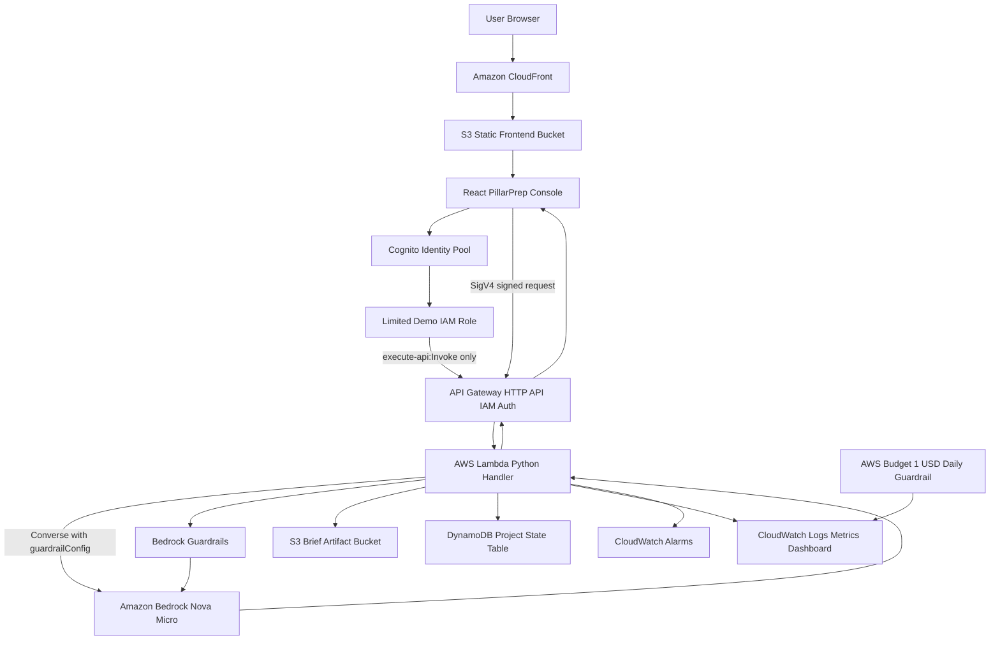

# PillarPrep AWS Infrastructure Design

This is the current deployment target for the hackathon frontend and backend. The goal is a working AWS-native demo path first, then deeper production hardening.

## Phase 1 AWS Stack



## Current Frontend Mode

The AWS-hosted frontend is deployed to S3 + CloudFront. It can run deterministic demo mode or live AI model mode. Live mode does not use an API key. The browser gets short-lived unauthenticated Cognito Identity credentials, assumes a limited demo IAM role, and SigV4-signs the API Gateway request.

Current frontend URL:

```text
https://d2e0btay0ynyf.cloudfront.net
```

## Request Flow With Models Enabled

1. The user enters customer context, ranked Well-Architected pillar priorities, decision-maker notes, and meeting notes.
2. The frontend gets short-lived demo credentials from Cognito Identity.
3. The frontend signs `POST /brief` with SigV4.
4. API Gateway checks IAM authorization and rejects unsigned requests.
5. API Gateway invokes the Lambda handler.
6. Lambda builds the Bedrock prompt contract and invokes the configured model.
7. Lambda normalizes the model JSON and stores the request/response artifact in S3.
8. Lambda writes project state metadata to DynamoDB.
9. The frontend receives technical brief, executive brief, stakeholder lens, game plan, objections, Project model answer, and Phase 2 artifacts.

## Model And Storage Boundary

PillarPrep does not store a copy of the Bedrock foundation model. The configured model ID, currently `us.amazon.nova-micro-v1:0`, is passed to Bedrock at invocation time and AWS manages the model weights, serving layer, and model lifecycle.

Stored by PillarPrep:

- Lambda code stores the prompt contract, schema instructions, structured fallback behavior, and the Bedrock guardrail configuration reference.
- S3 stores generated brief artifacts as JSON documents containing the request, response, timestamp, provider, and project metadata.
- DynamoDB stores project state records keyed by `projectId` and `sortKey` so the Project model can track generated briefs and handoff state.
- The browser stores unsaved local workspace state for demo continuity.

Future retrieval should add Bedrock Knowledge Bases over approved S3 artifacts. That creates searchable project memory without training, fine-tuning, or hosting a custom model.

## Deployed Resources

The frontend stack deploys these resources:

- `FrontendBucket`: private, encrypted, versioned S3 bucket for static React assets
- `FrontendDistribution`: CloudFront distribution with HTTPS redirect and SPA fallback
- `FrontendOriginAccessControl`: CloudFront OAC for private S3 access
- `FrontendBucketPolicy`: grants read access only to the CloudFront distribution

The backend stack deploys these resources:

- `BriefApi`: Amazon API Gateway HTTP API with IAM authorization on `POST /brief`
- `DemoInvokeIdentityPool`: Cognito Identity Pool for public demo credentials
- `DemoInvokeRole`: limited IAM role that can invoke only the brief route
- `BriefFunction`: Python 3.12 AWS Lambda handler
- `BriefSafetyGuardrail`: Bedrock Guardrail for harmful content and prompt-attack filtering
- `BriefSafetyGuardrailVersion`: pinned guardrail version used by Lambda at invocation time
- `BriefFunctionErrorAlarm`, `BriefFunctionThrottleAlarm`, `BriefFunctionDurationAlarm`: CloudWatch alarms for demo operations visibility
- `BriefArtifactsBucket`: private, encrypted, versioned S3 bucket for generated brief artifacts
- `ProjectStateTable`: DynamoDB table keyed by `projectId` and `sortKey`
- `BriefFunctionRole`: explicit least-privilege Lambda role for logs, X-Ray, Bedrock invocation, S3 artifacts, and DynamoDB state
- `DemoDailyBudget`: daily AWS Budget guardrail, default `$1/day`
- `PillarPrepDashboard`: CloudWatch dashboard for requests, success, unauthorized requests, Lambda health, API Gateway, and recent logs

## Resource Names And Tags

The templates and deploy scripts use a shared tagging standard. Default tags include `Project=PillarPrep`, `Application=sa-briefing-generator`, `Environment=demo`, `Owner=austin-adams`, `CostCenter=hackathon`, `ManagedBy=cloudformation`, `Repository=aadams35/Pilarprep`, and `DataClassification=demo`.

The `ResourcePrefix` parameter defaults to `pillarprep-demo` and drives safe display names such as `pillarprep-demo-brief-api`, `pillarprep-demo-brief-generator`, `pillarprep-demo-project-state`, `pillarprep-demo-demo-identities`, `pillarprep-demo-demo-api-invoke-role`, `pillarprep-demo-daily-demo-budget`, and `pillarprep-demo-cloudfront-web`.

Full standard: `docs/aws-resource-tags-and-names.md`. IAM controls: `docs/aws-iam-controls.md`.

## Client Login And Tenant Model

Today the public hackathon demo uses an unauthenticated Cognito Identity Pool so anyone with the CloudFront URL can receive short-lived credentials that can invoke only `POST /brief`. That is useful for showing the demo without shipping an API key, but it is not the final client-login model.

For a real customer or internal pilot, users should log in as themselves, then choose a client workspace they are authorized to access. The clean AWS path is Cognito User Pool for the hackathon/private pilot, or IAM Identity Center/SAML/OIDC for enterprise SSO. The login token should carry group or tenant claims such as `client:apex-mutual`, and Lambda should map those claims to allowed `clientId` values before reading or writing any project data.

Once that is in place, every stored object and record is scoped by client. S3 keys become `clients/{clientId}/projects/{projectId}/briefs/{timestamp}.json`; DynamoDB partitioning can use `clientId#projectId` or separate tenant and project keys; the UI only shows client workspaces from the user's allowed list. The model is still Bedrock-managed, but each client can have its own prompt profile, approved artifacts, Knowledge Base, guardrail policy, and retrieval filters.

Demo explanation: "You do not log into a model. You log into a client workspace. PillarPrep then loads that client's configuration, approved project memory, and safety policy before it calls Bedrock."
## Current Demo Boundary

Working now:

- AWS CloudFront static frontend
- Browser deterministic generator for no-model demos
- CloudFront live model mode through Cognito Identity + API Gateway IAM auth
- Local frontend demo on `http://localhost:3002/`
- Local live route with Cognito/IAM when `.env.local` includes the demo identity pool
- Local Lambda unit tests with mocked Bedrock
- AWS CLI deployment script for S3 + CloudFront frontend hosting
- AWS CLI deployment script for API Gateway, Lambda, S3, DynamoDB, Cognito Identity, IAM, AWS Budget, and CloudWatch dashboard

Still to decide:

- Whether to add a custom domain and ACM certificate
- Whether to replace the public demo identity with Cognito User Pool, IAM Identity Center, or another real auth layer after the hackathon demo
- Whether to add Bedrock Knowledge Bases and Strands for the full Project model follow-on loop

## Later Hardening

After the first demo works:

- Wire CloudWatch alarms to SNS/email once the demo owner list is final
- Replace the unauthenticated demo identity with real user auth before broader sharing
- Add Bedrock Knowledge Bases for retrieval over approved project artifacts
- Add Strands runtime for richer Project model tool orchestration
- Add WAF rate-based rules or usage quotas if the public URL stays open
