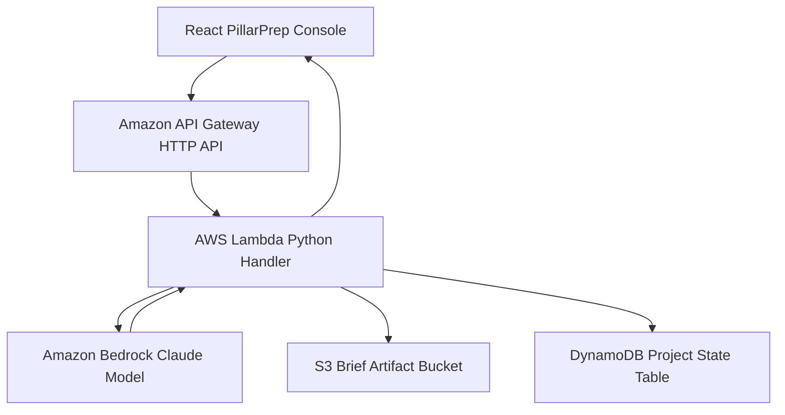

# PillarPrep AWS Infrastructure Design

This is the current deployment target for the hackathon backend. The goal is a working demo path first, then deeper production hardening.

## Phase 1 Backend Stack

## Request Flow

1. The user enters customer context, Well-Architected pillar priorities, decision-maker notes, and meeting notes.
2. The frontend posts the structured request to `/api/brief`.
3. In local demo mode, the frontend API route uses the deterministic demo generator.
4. In AWS mode, the frontend API route forwards the same request to API Gateway.
5. API Gateway invokes the Lambda handler.
6. Lambda builds the Bedrock prompt contract and invokes the configured model.
7. Lambda normalizes the model JSON and stores the request/response artifact in S3.
8. Lambda writes project state metadata to DynamoDB.
9. The frontend receives technical brief, executive brief, stakeholder lens, game plan, objections, Project Brain answer, and Phase 2 artifacts.

## Deployed Resources

The backend stack deploys these resources:

- `BriefApi`: Amazon API Gateway HTTP API with `POST /brief`
- `BriefFunction`: Python 3.12 AWS Lambda handler
- `BriefArtifactsBucket`: private, encrypted, versioned S3 bucket for generated brief artifacts
- `ProjectStateTable`: DynamoDB table keyed by `projectId` and `sortKey`
- IAM permissions for Lambda basic logs, Bedrock invocation, S3 artifact writes, and DynamoDB state writes

## Current Demo Boundary

Working now:

- Local frontend demo
- Local deterministic generator
- Local Project Brain ask loop
- Local Lambda unit tests with mocked Bedrock
- AWS CLI deployment script for API Gateway, Lambda, S3, and DynamoDB

Still to confirm in AWS account:

- Active AWS credentials
- Bedrock model access in `us-east-1`
- Successful CloudFormation deployment
- Live API Gateway URL wired into `PILLARPREP_BACKEND_URL`

## Later Hardening

After the first demo works:

- Add Bedrock Guardrails
- Scope Bedrock IAM permissions to the selected model ARN
- Add CloudWatch dashboard and alarms
- Add API key or lightweight auth before public sharing
- Add Bedrock Knowledge Bases for retrieval over approved project artifacts
- Add Strands runtime for richer Project Brain tool orchestration
