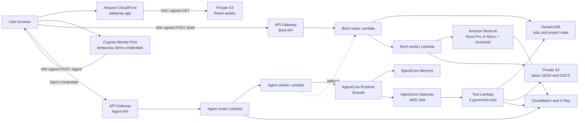
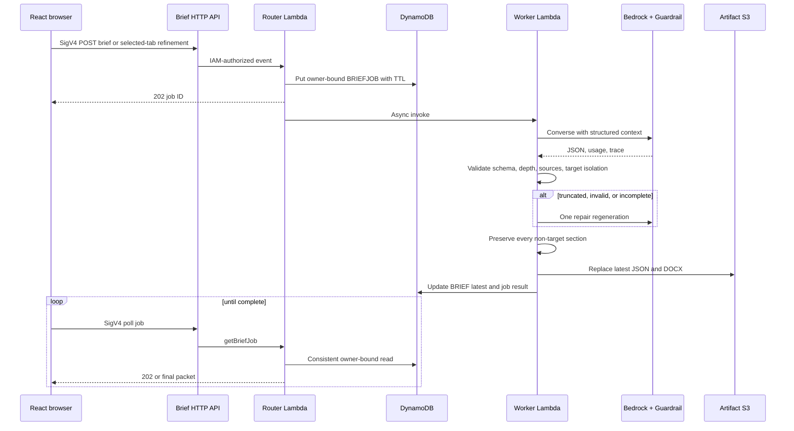
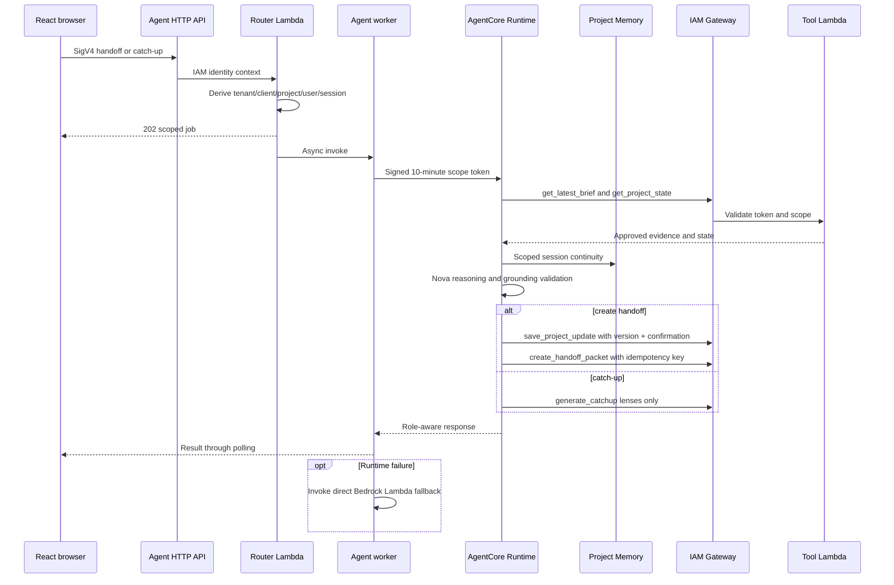
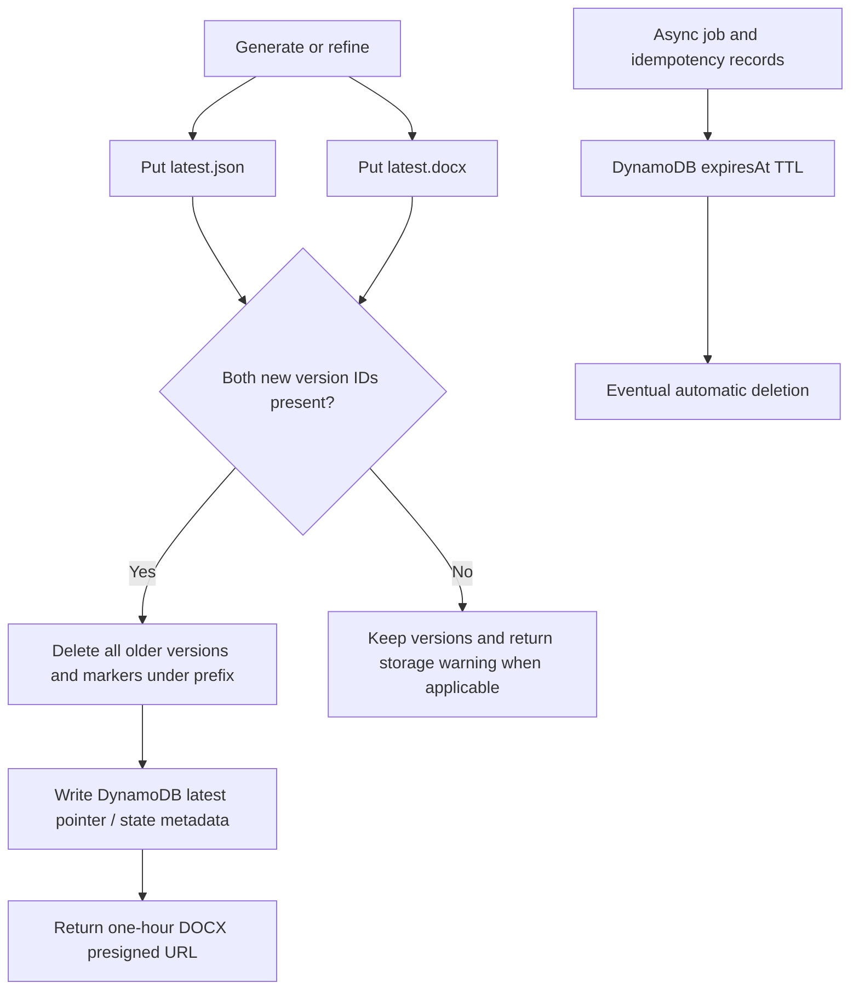

# PilarPrep AWS Infrastructure and Configuration

> **Historical pre-cutover audit.** This report describes the earlier two-API
> deployment as it existed on 2026-08-13. The public application now uses the
> unified SQS Jobs pipeline documented in
> [PilarPrep Unified Jobs Architecture](unified-jobs-architecture.md). Do not use
> the request-flow sections below as the current production explanation.

Verified against repository working tree `658500d288cf6a1f381dc7640baf817157c7cd71` plus uncommitted changes and live AWS account `386807258431` in `us-east-1` on 2026-08-13. No infrastructure was changed and no generation request was made during this audit.

**Evidence legend:** **Verified** means confirmed in live AWS and/or directly in code. **Inferred** means derived from code behavior but not exercised during this read-only audit. **Recommended** is a production improvement.

## 1. Architecture overview

### Executive summary

**Verified.** PilarPrep is a three-stack, serverless AWS application:

1. **Presentation:** a React/Vite single-page application is served by CloudFront from a private S3 origin.
2. **Briefing:** an IAM-authorized HTTP API queues long-running Nova Pro work to Lambda, invokes Amazon Bedrock with a guardrail, stores latest JSON/DOCX artifacts in S3, and records jobs/state in DynamoDB.
3. **Project continuity:** a second IAM-authorized HTTP API queues AgentCore handoff and catch-up jobs. AgentCore Runtime uses Strands, project-scoped Memory, and an IAM-authorized Gateway exposing five narrow Lambda tools.
4. **Operations:** CloudWatch logs, X-Ray tracing, custom EMF metrics, dashboards, alarms, tags, and a daily AWS Budget provide demo observability and cost awareness.

This design fits PilarPrep because traffic is intermittent, generation can exceed API Gateway's synchronous comfort window, outputs are document-shaped, and follow-on work needs governed state and memory rather than another stateless prompt.

### 30-second explanation

> PilarPrep is a serverless React application on private S3 behind CloudFront. The browser obtains short-lived demo credentials from Cognito and signs requests to two IAM-protected API Gateway endpoints. Lambda orchestrates Bedrock Nova Pro for brief generation and stores the latest JSON and DOCX in private S3 while DynamoDB tracks jobs and project state. After approval, AgentCore uses scoped memory and five governed tools to turn the latest brief into a role-aware handoff or catch-up, with the original Lambda path available as a fallback.

### 2-minute explanation

> The browser first loads a static React bundle through CloudFront. The S3 origin is not public; CloudFront signs origin requests through Origin Access Control. For the demo, Cognito Identity Pools issues an unauthenticated visitor short-lived AWS credentials. The browser uses Signature Version 4 to call only the POST `/brief` and POST `/agent` routes allowed by that role.
>
> Brief generation enters a 30-second router Lambda. Nova Pro requests are queued in DynamoDB and dispatched asynchronously to a 180-second worker Lambda, while Nova Micro can run synchronously. The worker builds a structured prompt from customer context, company values, stakeholder notes, meeting notes, and ranked Well-Architected priorities. Bedrock applies guardrail version 2, and the application validates JSON shape, content depth, source labels, and refinement isolation. It can retry for truncation, invalid JSON, or incomplete refinement. The latest JSON and DOCX replace prior S3 versions, and DynamoDB stores the latest pointer and one-hour job records.
>
> Once the user approves the brief, the handoff request goes to a separate AgentCore API and asynchronous worker. The router derives tenant, client, project, user, and session scope from the caller, signs that scope for ten minutes, and invokes an AgentCore Runtime. The Strands agent reads the latest brief and project state through an IAM-only Gateway, reasons with Nova Pro and project-scoped Memory, then conditionally writes a versioned project update and latest-only handoff. Catch-up uses the same evidence but is read-only. The key production caveat is that the current UI approval is browser state, not a durable server-side approval record.

## 2. Infrastructure inventory

| AWS service / resource | Purpose | Important configuration | Auth / data | Scaling and primary failure | Source |
|---|---|---|---|---|---|
| CloudFormation `pillarprep-frontend` | Frontend stack | `UPDATE_COMPLETE`; S3, OAC, CloudFront | Stack tags identify PilarPrep/demo | Managed service; drift can remove manual domain settings | `backend/frontend_static/template.yaml:22` |
| S3 `pillarprep-frontend-386807258431-us-east-1` | React build assets | Public access blocked, BucketOwnerEnforced, versioned, SSE-S3 | CloudFront service principal only | Scales automatically; bad cache/build upload | `backend/frontend_static/template.yaml:62` |
| CloudFront `E3N3M69BO7PCI9` | Public HTTPS frontend | HTTP/2+3, compression, HTTPS redirect, OAC, caching optimized, SPA 403/404 rewrite | Public viewer; signed S3 origin | Global scale; stale cache or origin/config drift | `backend/frontend_static/template.yaml:100` |
| ACM certificate / alias | `pilarprep.app` TLS | Live alias with ACM TLS 1.2 certificate | Public DNS/TLS | Certificate/DNS mismatch | **Live-only; absent from current IaC** |
| AWS WAF Web ACL `CreatedByCloudFront-c2026b50` | Edge inspection | IP reputation, common, bad-input managed groups | Attached to CloudFront | All three rules currently `COUNT`, so they observe rather than block | Live CloudFront/WAF query |
| CloudFormation `pillarprep-bedrock` | Core briefing stack | `UPDATE_COMPLETE` | Stack tags identify owner/cost center | Stack rollback/update failure | `backend/bedrock_lambda/template.yaml:41` |
| Cognito Identity Pool `us-east-1:51a...` | Demo temporary credentials | Unauthenticated identities allowed; classic flow off | Federates into one unauthenticated role | Public credential issuance can drive API usage | `backend/bedrock_lambda/template.yaml:156` |
| IAM role `pillarprep-demo-demo-api-invoke-role` | Browser API permission | Exact POST `/brief` and `/agent` ARNs only | Temporary Cognito identities | No S3, DDB, Lambda, or Bedrock access | `backend/bedrock_lambda/template.yaml:182`; `backend/agentcore/template.yaml:792` |
| HTTP API `pzgejfvvpa` | Brief API | `$default`, auto-deploy, IAM auth, CORS for CloudFront origin | SigV4; customer context enters here | No explicit throttles/access logs; 30-second integration | `backend/bedrock_lambda/template.yaml:123` |
| Lambda `pillarprep-demo-brief-generator` | Validate, queue/poll, optional sync generation | Python 3.12 x86_64, 512 MB, 30 s, X-Ray | Scoped Bedrock/S3/DDB/worker role | Unreserved concurrency; API timeout | `backend/bedrock_lambda/template.yaml:513` |
| Lambda `pillarprep-demo-brief-worker` | Long-running brief/refinement generation | Python 3.12 x86_64, 512 MB, 180 s, X-Ray | Scoped Bedrock/S3/DDB role | Async invoke has AWS retries but no explicit DLQ/destination | `backend/bedrock_lambda/template.yaml:542` |
| Bedrock Nova Pro / Micro | Foundation-model inference | Primary `us.amazon.nova-pro-v1:0`; alternate `us.amazon.nova-micro-v1:0` | Lambda and AgentCore roles only | Throttle, model access, truncation, invalid output | `backend/bedrock_lambda/app.py:13` |
| Bedrock Guardrail `4n4bcsibf83u:2` | Prompt/output safety | Prompt attacks high on input; five content categories plus misconduct at medium | Applied during Bedrock Converse | Intervention can require regeneration | `backend/bedrock_lambda/template.yaml:639` |
| S3 `pillarprep-bedrock-briefartifactsbucket-nwvlt6tay5zk` | JSON and DOCX artifacts | Private, versioned, SSE-S3; application deletes previous versions | Lambda/tool roles; 1-hour presigned DOCX download | Partial write or cleanup failure; no lifecycle | `backend/bedrock_lambda/template.yaml:568` |
| DynamoDB `pillarprep-bedrock-ProjectStateTable-1TVIRZ6WP8KRI` | Jobs, latest pointers, project registers, idempotency | On-demand; PK `projectId`, SK `sortKey`; TTL `expiresAt` | Lambda and tool roles | Hot tenant key unlikely in demo; no PITR/deletion protection | `backend/bedrock_lambda/template.yaml:602` |
| CloudFormation `pillarprep-agentcore` | Governed project AI stack | `UPDATE_COMPLETE` | Reuses brief bucket, table, demo role, guardrail | Cross-stack output/config mismatch | `backend/agentcore/template.yaml:5` |
| HTTP API `e7h5uposd9` | Handoff/catch-up API | `$default`, auto-deploy, IAM auth, same CORS policy | SigV4 | No explicit throttles/access logs | `backend/agentcore/template.yaml:133` |
| Lambda `pillarprep-demo-agent-router` | Scope derivation, queue, polling | Python 3.12 ARM64, 512 MB, 30 s | DDB jobs + exact worker invoke only | Rejects missing/mismatched scope | `backend/agentcore/template.yaml:333` |
| Lambda `pillarprep-demo-agent-worker` | Invoke runtime, record result, fallback | Python 3.12 ARM64, 512 MB, 180 s | Runtime, secret, DDB, fallback Lambda | Runtime failure falls back; no DLQ | `backend/agentcore/template.yaml:363` |
| AgentCore Runtime `PilarPrepProjectAgent-FjGV7rBEmT` | Strands reasoning | READY, Python 3.12 code in deployment S3, HTTP, public network mode | Resource policy permits worker role only | Runtime/model/Gateway failure invokes fallback | `backend/agentcore/template.yaml:741` |
| AgentCore Gateway `...zafwhugtiw` | MCP-style governed tools | READY, AWS_IAM, one Lambda target, five tools | Runtime role only | Tool schema/scope failure | `backend/agentcore/template.yaml:547` |
| Lambda `pillarprep-demo-agent-tools` | Read/write project evidence | Python 3.12 ARM64, 512 MB, 30 s | Verifies HMAC scope token; scoped S3/DDB | Conditional write or artifact mismatch | `backend/agentcore/tools/app.py:429` |
| AgentCore Memory `PilarPrepProjectMemory-YInIzDEv62` | Session continuity | ACTIVE; seven-day event expiry; no long-term strategies | Runtime role; actor/session derived from project scope | Memory unavailable degrades/aborts agent request | `backend/agentcore/template.yaml:648` |
| Secrets Manager scope secret | Internal scope binding | Generated 48-character secret, confidential tag | Worker/tools only | Rotation not configured | `backend/agentcore/template.yaml:165` |
| CloudWatch / X-Ray | Logs, metrics, traces, dashboards, alarms | Five Lambda log groups at 14 days; two dashboards; five alarms | Service roles | Alarms have no actions; AgentCore runtime logs have no retention | `backend/bedrock_lambda/template.yaml:692`; `backend/agentcore/template.yaml:805` |
| AWS Budget `pillarprep-demo-daily-demo-budget` | Cost visibility | Daily USD 1; live actual spend was USD 0.525 at audit time | No notification email configured | Alert only, never a hard stop | `backend/bedrock_lambda/template.yaml:940` |
| Deployment S3 `pillarprep-deploy-386807258431-us-east-1` | Packaged Lambda/layer/runtime code | Holds dated AgentCore runtime zip and SDK layer | Deployment/runtime roles | Old packages can accumulate | `scripts/deploy-agentcore.ps1` |

## 3. Configuration inventory

| Configuration | Live value / behavior | Status |
|---|---|---|
| Region / account | `us-east-1` / account ending `8431` | **Verified** |
| Resource prefix / tags | `pillarprep-demo`; Project=PilarPrep, Environment=demo, Owner=austin-adams, CostCenter=hackathon, ManagedBy=cloudformation, Repository=aadams35/Pilarprep, DataClassification=demo | **Verified** |
| Frontend origin | `https://d2e0btay0ynyf.cloudfront.net`; alias `pilarprep.app` | **Verified** |
| CloudFront price class | `PriceClass_All` because template parameter is blank | **Verified** |
| CloudFront access logs | Disabled | **Verified** |
| Frontend build variables | static demo true; brief API, agent API, `us-east-1`, and identity pool embedded in deployed JS | **Verified** (`scripts/deploy-aws-frontend.ps1:131`) |
| Brief API | `https://pzgejfvvpa.execute-api.us-east-1.amazonaws.com/brief` | **Verified** |
| Agent API | `https://e7h5uposd9.execute-api.us-east-1.amazonaws.com/agent` | **Verified** |
| API auth | `AWS_IAM`; API key environment is empty | **Verified** |
| CORS | Only `https://d2e0btay0ynyf.cloudfront.net`; POST/OPTIONS and SigV4 headers | **Verified** |
| Identity pool | `us-east-1:51a31152-80e4-453f-b17e-5077109376fa`; unauthenticated enabled | **Verified** |
| Brief model | Nova Pro primary, Nova Micro alternate; allowlist contains only those two | **Verified** |
| Model inference | Temperature 0.2, max 5,000 tokens; optimized latency requested for Nova Pro | **Verified** (`backend/bedrock_lambda/app.py:618`) |
| Guardrail | `4n4bcsibf83u`, version `2`, status READY | **Verified** |
| Artifact bucket | `pillarprep-bedrock-briefartifactsbucket-nwvlt6tay5zk` | **Verified** |
| Project table | `pillarprep-bedrock-ProjectStateTable-1TVIRZ6WP8KRI`; PAY_PER_REQUEST; 78 items / 22,653 bytes at audit | **Verified** |
| Async jobs | One-hour TTL, 350 KB maximum stored result, browser polls every ~1.5 seconds for up to four minutes | **Verified** (`backend/bedrock_lambda/app.py:71`; `frontend/app/page.tsx:2039`) |
| Agent demo scope | tenant `demo`; only client `bluemesa-payments`; local identity off | **Verified** |
| Agent legacy bridge | Enabled; reads `clients/bluemesa-payments/brief/latest.json` if tenant-scoped brief is absent | **Verified** |
| Agent runtime | READY; public network mode; Python 3.12; runtime package `agentcore/runtime/20260813T210128Z-runtime.zip` | **Verified** |
| Agent memory | Seven-day event expiry; no configured memory strategies | **Verified** |
| Permissions boundaries | Empty on all three stacks | **Verified** |
| Encryption | Both S3 buckets SSE-S3; DynamoDB AWS-owned default encryption; TLS in transit | **Verified** |
| Backup/retention | S3 versioning on but app purges old artifact versions; no S3 lifecycle; DDB TTL on, PITR off | **Verified** |

**Configuration disagreements:**

- **Verified:** live CloudFront has alias `pilarprep.app` and an ACM certificate, but the current frontend template has no alias/certificate parameters. This is IaC drift and a later stack update could remove or fail to reproduce the domain.
- **Verified:** API CORS allows the CloudFront domain, not `https://pilarprep.app`. Calls made from the custom domain can be blocked by the browser even when SigV4 succeeds.
- **Verified:** WAF is attached but all managed groups use `COUNT`, so it is monitoring only.
- **Verified:** the UI labels a packet approved in browser state, while every generation/refinement immediately replaces `latest.json` and `latest.docx`. AgentCore calls that object approved without a server-side approval flag.
- **Verified:** an older AgentCore runtime log group (`...E2HoVk9M4Z...`) remains and has no retention policy; the current runtime log group also has no explicit retention.
- **Inferred:** the deployed packages were built from this working tree recently, but the tree is dirty and package hashes were not compared, so exact source-to-deployment identity is not proven.

## 4. End-to-end flows

### Initial brief generation

1. **Verified:** React collects customer, values URL/text, ranked pillars, stakeholders, and meeting context (`frontend/app/page.tsx:2247`).
2. **Verified:** Cognito returns temporary credentials; the browser signs the JSON request for `execute-api` (`frontend/lib/pillarprep/aws-sigv4.ts:75`, `:130`).
3. **Verified:** Nova Pro requests set `asyncGeneration=true`; the router writes `BRIEFJOB#<uuid>` with owner and one-hour TTL, invokes the worker asynchronously, and returns 202 (`frontend/app/page.tsx:2039`; `backend/bedrock_lambda/app.py:2072`).
4. **Verified:** the worker invokes Bedrock Converse, applies the guardrail, validates/retries, writes latest JSON/DOCX, and updates `BRIEF#LATEST` (`backend/bedrock_lambda/app.py:2131`, `:2382`).
5. **Verified:** the browser polls the same IAM route; owner identity must match before the result is returned (`backend/bedrock_lambda/app.py:2024`).

### Refinement of one selected tab

1. **Verified:** the browser sends `refinementTarget`, feedback, base version, and a snapshot of the prior packet (`frontend/app/page.tsx:2240`).
2. **Verified:** the prompt asks Bedrock to return only that target. The server merges it over a deep copy of the prior packet and restores every non-target section (`backend/bedrock_lambda/app.py:1239`).
3. **Verified:** business-case refinement must change at least four fields; list tabs must change at least two passages, or the model is retried/fallback is used (`backend/bedrock_lambda/app.py:1304`, `:2271`).
4. **Verified:** server and browser independently reject cross-tab changes (`backend/bedrock_lambda/app.py:2352`; `frontend/app/page.tsx:2349`).

### Approval and version invalidation

1. **Verified:** approve sets React state/history only (`frontend/app/page.tsx:2445`).
2. **Verified:** any later prebrief generation clears approval; refinement marks the previous approval stale (`frontend/app/page.tsx:2421`).
3. **Verified:** handoff generation is blocked in the UI until the current packet is approved (`frontend/app/page.tsx:2230`).
4. **Gap:** no server approval transaction exists. The S3 object is already replaced before approval, so a different browser cannot reliably distinguish draft from approved.

### DOCX and JSON persistence

- **Verified:** direct brief output uses `clients/<client>/brief/latest.json|docx`; direct fallback handoff uses `clients/<client>/handoff/latest.*` (`backend/bedrock_lambda/app.py:1775`).
- **Verified:** AgentCore handoff uses `tenants/<tenant>/clients/<client>/projects/<project>/handoff/latest.*` (`backend/agentcore/tools/app.py:317`).
- **Verified:** after both objects are written, prior versions and delete markers under the prefix are deleted. A 1-hour presigned DOCX URL is returned (`backend/bedrock_lambda/app.py:1803`; `backend/agentcore/tools/app.py:293`).

### AgentCore handoff generation

1. **Verified:** the browser sends the approved snapshot with `confirmWrite=true` and an idempotency key (`frontend/app/page.tsx:1920`).
2. **Verified:** the router derives scope from IAM/Cognito identity, restricts the demo to BlueMesa, creates an agent job, and invokes the worker (`backend/agentcore/router/app.py:97`, `:400`).
3. **Verified:** the worker signs a ten-minute internal scope token and invokes AgentCore Runtime; failures invoke the direct Lambda fallback (`backend/agentcore/router/app.py:350`).
4. **Verified:** the Runtime reads latest brief and state through Gateway, confirms the browser snapshot still matches S3, uses Nova + Memory, validates grounding, then calls `save_project_update` and `create_handoff_packet` (`backend/agentcore/runtime/service.py:637`).
5. **Verified:** writes require `confirmWrite=true`, optimistic version matching, and idempotency records (`backend/agentcore/tools/app.py:188`, `:317`).

### Catch-up workflow

- **Verified:** the same router/runtime path uses `generate_catchup` with `confirmWrite=false`; it reads latest brief, project state, and role-specific lenses, then returns a tailored explanation without updating state/artifacts (`frontend/app/page.tsx:2482`; `backend/agentcore/runtime/service.py:656`).
- **Verified:** roles include Sales, Solutions Architect, Executive, PM, Engineer, and New member (`backend/agentcore/tools/app.py:405`).
- **Current limitation:** the catch-up library list is browser-local history; the backend has no general client-list/latest-brief retrieval API.

### Downloading a saved brief

- **Verified:** no public download API exists. Lambda/tool code returns a one-hour S3 presigned URL, and the browser opens it directly. Anonymous S3 HEAD requests returned 403 during this audit.

## 5. Security and IAM

**Verified strengths**

- Frontend and artifact buckets block all public access; the frontend policy allows only the exact CloudFront distribution through OAC.
- Browser credentials are temporary and can invoke only two exact API routes; there are no long-lived API keys in the frontend.
- API Gateway enforces IAM before Lambda. CORS is an additional browser control, not authorization.
- Brief roles limit Bedrock to two model families, guardrail application to one ARN, S3 to brief/handoff prefixes, DynamoDB to one table, and worker invocation to one function (`backend/bedrock_lambda/template.yaml:286`).
- AgentCore resource policies permit worker-to-Runtime and Runtime-to-Gateway only. Gateway can invoke only the tool Lambda (`backend/agentcore/template.yaml:778`).
- The router derives scope from the caller rather than trusting browser tenant/user fields. Gateway tools verify an HMAC-signed, expiring scope token and compare tenant/client/project fields (`backend/agentcore/common/security.py:40`).

**Demo-only compromises**

- Anyone on the internet can request unauthenticated Cognito credentials. IAM authorization is real, but it does not identify a human user.
- The brief API accepts arbitrary company/client payloads and stores them in legacy `clients/*` paths. AgentCore restricts its demo identity to BlueMesa, but the brief path is not tenant-isolated.
- The legacy BlueMesa read path is explicitly enabled. Disable it after migrating briefs to tenant/project prefixes.
- IAM permissions use wildcard tenant/client/project S3 prefixes for the tool role; isolation ultimately depends on correctly verified application scope tokens.
- No permissions boundary is configured. No customer-managed KMS keys, key rotation policy, VPC endpoint/private network, or CloudTrail data-event configuration was found.

**Recommended production identity design**

Use Cognito User Pools or an enterprise OIDC/SAML IdP for sign-in, place `tenantId`, allowed clients, and projects in trusted claims, use a JWT authorizer or Identity Pool authenticated role mapping, remove unauthenticated identities, and enforce tenant scope in both application logic and IAM/ABAC. Keep API keys out; they identify an application/usage plan, not a user, and are weak authorization for customer data.

## 6. Bedrock and AgentCore

### Bedrock generation

- **Verified:** Nova Pro is the quality path; Nova Micro is the lower-cost alternate. Selection is an allowlisted request preference, not an arbitrary model ID (`backend/bedrock_lambda/app.py:13`).
- **Verified:** prompts combine system rules and structured request JSON. Customer context, company values and URL, approved stakeholder notes, meeting notes, ranked pillars, feedback, and approved brief are provided as evidence (`backend/bedrock_lambda/app.py:618`; prompt contract around `:512`).
- **Verified:** the model returns structured JSON. Parsing, minimum word counts, required `Ask:` questions, allowed source labels, target-specific refinement, and packet completeness are checked in code.
- **Verified:** one regeneration can occur for guardrail intervention/max tokens, invalid JSON, or incomplete refinement. A deterministic local fallback can preserve demo continuity; metadata identifies fallback and reason (`backend/bedrock_lambda/app.py:2131`).
- **Verified:** usage, latency, stop reason, retries, model ID, guardrail trace, and an internal estimated cost are attached to metadata and emitted as CloudWatch metrics (`backend/bedrock_lambda/app.py:2382`).
- **Important:** the foundation model is managed by Amazon Bedrock. It is not downloaded or stored in S3. S3 stores application packages, prompts inside request artifacts, generated JSON/DOCX, and handoff outputs.

### Why AgentCore adds value

Direct Bedrock is appropriate for stateless brief generation. AgentCore adds governed orchestration for follow-on work: project/session Memory, an IAM-protected Gateway, explicit tool contracts, optimistic state updates, idempotency, audience-aware catch-up, and a traceable handoff workflow. That turns “generate text” into “read approved evidence, reason, update project registers, and save one canonical handoff.”

**Verified AgentCore behavior**

- Runtime and Gateway are READY; Runtime network mode is PUBLIC but invocation is restricted by resource policy.
- Five tools are exposed: `get_latest_brief`, `get_project_state`, `save_project_update`, `create_handoff_packet`, and `generate_catchup` (`backend/agentcore/template.yaml:565`).
- Memory actor is tenant/client/project; session adds the browser session ID. Events expire after seven days (`backend/agentcore/runtime/memory.py:22`).
- Handoff validates that the approved browser snapshot equals the latest stored brief before writing (`backend/agentcore/runtime/service.py:559`).
- Runtime failure falls back to the direct brief Lambda and marks `fallbackUsed`, `memoryUsed=false`, and `gatewayUsed=false` (`backend/agentcore/router/app.py:309`).

## 7. Storage and data lifecycle

### S3 namespaces

| Data | Key pattern | Retention |
|---|---|---|
| Legacy/demo brief | `clients/<client>/brief/latest.json|docx` | Latest pair only |
| Direct fallback handoff | `clients/<client>/handoff/latest.json|docx` | Latest pair only |
| Tenant project brief target | `tenants/<tenant>/clients/<client>/projects/<project>/brief/latest.json` | Reader exists; current direct writer does not populate it |
| AgentCore handoff | `tenants/<tenant>/clients/<client>/projects/<project>/handoff/latest.json|docx` | Latest pair only |

**Verified:** bucket versioning protects the write operation, but application cleanup intentionally deletes every prior version once both new files are written. There is no S3 lifecycle rule. This meets the “one latest copy” demo requirement but removes rollback/audit history.

### DynamoDB access patterns

| Partition / sort key | Purpose |
|---|---|
| `<legacy-client-id>` / `BRIEF#LATEST` | Latest direct brief pointer and refinement metadata |
| `<legacy-client-id>` / `HANDOFF#LATEST` | Latest direct fallback handoff pointer |
| `<legacy-client-id>` / `BRIEFJOB#<uuid>` | Brief async status/result, one-hour TTL, owner-bound polling |
| `TENANT#...|CLIENT#...|PROJECT#...` / `PROJECT#STATE` | Canonical assumptions, decisions, risks, actions, owners, milestones, open questions, version |
| Same tenant partition / `AGENTJOB#<uuid>` | Agent async status/result, one-hour TTL, user/session-bound polling |
| Same tenant partition / `IDEMPOTENCY#<tool>#<key>` | Duplicate-write protection with TTL |

**Verified:** DynamoDB on-demand mode matches bursty demo usage. Default AWS-owned encryption is active even though `SSEDescription` is null. PITR and deletion protection are disabled.

### Data concepts

- **Model configuration:** model IDs, temperature, token cap, guardrail ID/version; stored in CloudFormation parameters and runtime environment variables.
- **Prompts:** server-side templates in Python plus request-specific structured context; not a customer-specific model.
- **Customer context:** form inputs and approved source labels, included in S3 request documents and some DynamoDB metadata.
- **Generated artifacts:** latest JSON/DOCX in S3.
- **Project memory:** short-lived AgentCore conversational events scoped by tenant/client/project/session.
- **Project state:** durable structured registers and version in DynamoDB.

## 8. Observability and operations

**Verified controls**

- Lambda X-Ray tracing is active for all five functions.
- Lambda log groups have 14-day retention. AgentCore runtime log groups have no explicit retention.
- `pillarprep-demo-ops-dashboard` shows request/success/error counts, estimated Bedrock spend, token volume, latency, API reliability, and recent evidence logs (`backend/bedrock_lambda/template.yaml:802`).
- `pillarprep-demo-agentcore` shows router/tool health, latency, outcomes/fallbacks, and scoped tool audit logs (`backend/agentcore/template.yaml:853`).
- Five alarms are currently OK: brief errors, throttles, slow duration, agent-router errors, and agent-tools errors.

**Operational gaps**

- Alarms have no SNS/incident actions, so “OK/ALARM” is visible only when someone looks.
- HTTP API access logging and detailed route metrics are disabled; no explicit route throttles exist.
- Worker errors/throttles/duration and AgentCore Runtime health lack dedicated alarms.
- No DLQ or Lambda destination captures failed asynchronous invocations.
- CloudFront access logging is disabled; WAF rules count but do not block.

**Troubleshooting flow**

1. Confirm CloudFront bundle contains current API/pool IDs and the browser origin matches CORS.
2. Inspect API 4xx first: 401/403 means SigV4/role/scope; 400 means contract validation.
3. For a 202 that stalls, inspect the DynamoDB job item, then router and worker logs using job/trace ID.
4. For generation failure, inspect Bedrock stop reason, guardrail trace, retry reason, token counts, and worker duration.
5. For AgentCore failure, check router fallback events, Runtime logs, Gateway/tool audit, scope mismatch, latest-brief match, and optimistic version conflict.
6. For missing downloads, verify artifact key, S3 write warning, and presigned URL age. Regenerate a URL after one hour.

## 9. Cost model

**Verified current control:** the daily budget is USD 1 and reported USD 0.525 actual spend during the audit. It has no notification subscriber and does not stop resources.

**Fixed or fixed-ish:** Secrets Manager secret storage; WAF/Web ACL and managed-rule pricing unless covered by a CloudFront plan; possibly custom metrics/alarms beyond free allowances. **Usage-based:** Bedrock input/output tokens, AgentCore Runtime/Gateway/Memory, Lambda GB-seconds and requests, API Gateway requests, DynamoDB reads/writes/storage, S3 storage/requests, CloudFront transfer/requests, CloudWatch logs/metrics, and X-Ray traces.

The internal estimator currently uses Nova Pro USD 0.80/M input and USD 3.20/M output and Nova Micro USD 0.035/M input and USD 0.14/M output (`backend/bedrock_lambda/app.py:67`). Treat these as code constants, not an authoritative 2026 quote. For an illustrative 6,000-input/4,000-output-token Pro call, that formula estimates about USD 0.0176 before retries, AgentCore, and surrounding AWS services. A retry roughly adds another model call.

**Recommended controls for roughly USD 1/day:** use Micro for practice and Pro only for judged runs; cap daily generations in application state; add API throttles and reserved concurrency; subscribe the budget; alarm on custom estimated spend; remove orphan runtimes/packages; keep short log retention; and disable/delete demo resources after the event. Verify all current prices in the official AWS Pricing pages or Pricing Calculator immediately before presenting.

## 10. Well-Architected assessment

| Pillar | Current strength | Current compromise | Production improvement |
|---|---|---|---|
| Security | Private S3, OAC, IAM APIs, least-privilege roles, guardrail, signed scope | Anonymous demo identity; legacy unscoped brief path; WAF count-only | Authenticated federation, durable tenancy, blocking WAF after tuning, KMS, CloudTrail data events |
| Reliability | Managed serverless services, async workers, retries, deterministic and Lambda fallback | No DLQ, PITR, deletion protection, artifact rollback, or server approval | SQS queues/DLQs, Step Functions where useful, PITR, approval transaction, retained audit versions |
| Operational Excellence | IaC, tags, dashboards, alarms, X-Ray, structured logs | Domain drift, no alarm actions/access logs, dirty source/deploy provenance | Make domain/WAF fully IaC, CI/CD immutable artifacts, runbooks, alert routing, deployment SHA metadata |
| Performance Efficiency | CDN, on-demand DDB, async Pro work, ARM64 agent Lambdas | Brief Lambdas x86_64; four-minute browser polling; no load evidence | Benchmark memory/architecture, WebSocket/event result option, tune token budget and caching |
| Cost Optimization | Serverless/on-demand, model switch, latest-only artifacts, daily budget | Budget is alert-only and unsubscribed; PriceClass_All; public API can be exercised | Usage quotas, authenticated access, PriceClass review, current pricing alarms, post-demo teardown |
| Sustainability | No always-on servers/VPC/NAT/RDS; autoscaling managed services | Retries and oversized prompts waste tokens; old runtime/log/package remains | Prompt compaction, eval-driven model routing, cleanup automation, right-size functions |

## 11. Architecture diagrams

### Overall AWS architecture

### Brief generation and refinement

### AgentCore handoff and catch-up

### IAM and authentication flow

```mermaid
flowchart LR
  B["Public browser"] --> C["Cognito Identity Pool<br/>unauthenticated demo identity"]
  C --> STS["STS temporary credentials<br/>max session 1 hour"]
  STS --> SIG["Browser SigV4 signer"]
  SIG -->|"execute-api:Invoke exact routes"| API["API Gateway AWS_IAM"]
  API --> L["Router Lambda role"]
  L -->|"signed 10-minute tenant scope"| R["AgentCore Runtime role"]
  R -->|"resource policy"| G["Gateway AWS_IAM"]
  G -->|"exact Lambda target"| T["Tool Lambda role"]
  T -->|"verified tenant/client/project prefix"| DATA["S3 and DynamoDB"]
```

### Latest-only data lifecycle

## 12. Judge Q&A

**Why Bedrock instead of SageMaker?** Bedrock gives managed foundation-model access, Converse, guardrails, and usage-based inference without training or hosting infrastructure. PilarPrep is prompt-and-grounding work, not custom model training. SageMaker becomes relevant if we need a custom-trained model, specialized endpoint control, or a broader ML lifecycle.

**Why AgentCore instead of only Lambda plus Bedrock?** Lambda plus Bedrock generates a brief. AgentCore governs the follow-on workflow: scoped memory, tool contracts, project-state updates, idempotency, audience-aware catch-up, and an auditable path from approved evidence to handoff.

**Why DynamoDB and S3?** S3 is economical for complete JSON/DOCX documents and presigned downloads. DynamoDB is better for small, frequently updated job/status records, optimistic project versions, and idempotency keys. Each service handles the access pattern it is designed for.

**How is customer data isolated?** In AgentCore, scope is derived from identity, encoded as tenant/client/project partition and prefix, signed with an expiring HMAC token, and revalidated by every tool. For production, the unauthenticated demo identity and legacy `clients/*` writer must be replaced with authenticated tenant claims and fully tenant-scoped brief storage.

**Can someone access the frontend S3 bucket directly?** No anonymously. Public access block is enabled, the bucket policy is not public, and only the exact CloudFront distribution may read objects through OAC. Direct anonymous HEAD requests returned 403. The frontend itself is intentionally public through CloudFront.

**How are hallucinations reduced?** Structured approved context, low temperature, explicit output schema, source-label allowlists, guardrails, section-depth validators, grounded-source validation, retries, and deterministic fallback. AgentCore may use only the latest brief, approved outcomes, project state, and scoped memory.

**What happens if the model modifies the wrong brief?** The server restores non-target sections from the previous packet and calculates unauthorized changes; the browser independently compares versions. A cross-tab change is rejected and the current packet is preserved.

**What happens when AgentCore or Bedrock fails?** AgentCore falls back to the direct Bedrock Lambda and clearly marks the result. Bedrock output can be retried once for guardrail/truncation/JSON/completeness failures, then use a deterministic fallback. If both agent and Lambda fail, the approved brief remains unchanged.

**Where is the model stored?** The Nova model is hosted and managed by Amazon Bedrock. S3 stores deployment code and generated/customer artifacts, not the foundation-model weights. Customer-specific behavior is configuration, prompts, approved context, state, and memory.

**How would this become multi-tenant and production-ready?** Add enterprise sign-in and tenant claims, move all brief keys to tenant/project namespaces, create durable approval/version records, remove legacy access, enforce quotas, turn tuned WAF rules to block, enable PITR/deletion protection/audit retention, add DLQs and alert actions, and make domain/certificate configuration reproducible in IaC.

**What is the biggest architectural risk?** Approval is not durable. The backend stores every generated/refined packet as latest before the browser approves it, while AgentCore treats latest as approved. That is the first issue to fix before real customer use.

**How much does one generation cost?** It depends on input/output tokens, retries, model, and AgentCore/tool usage. The code's illustrative Nova Pro formula produces roughly USD 0.0176 for 6K input and 4K output tokens, before retries and other services. Quote current AWS pricing, not this estimate, during final cost validation.

**What would you improve with two more weeks?** Durable server approval and audit history; authenticated multi-tenancy; custom-domain/CORS IaC; queue/DLQ reliability; PITR and alarms with actions; a server-backed latest-client library; and eval-driven routing between Micro and Pro.

## 13. Known gaps and production roadmap

### P0 before customer data

1. **Recommended:** create a server-side approval endpoint/transaction that writes immutable packet version, approver, timestamp, content hash, and status; make AgentCore accept only that exact approved version.
2. **Recommended:** replace unauthenticated Cognito identities with authenticated User Pool/enterprise IdP identities and tenant claims; add abuse quotas.
3. **Recommended:** migrate direct brief artifacts and DDB keys to tenant/client/project scope; disable `AllowLegacyDemoBrief`.
4. **Recommended:** add `pilarprep.app`, ACM certificate, and matching API CORS origins to IaC immediately.

### P1 reliability and operations

5. Turn WAF rules from count to block after reviewing sampled requests.
6. Enable DynamoDB PITR and deletion protection; decide whether approved artifacts need Object Lock or retained versions.
7. Add SQS between routers and workers, DLQs/destinations, idempotent job dispatch, and worker alarms.
8. Enable API and CloudFront access logs, detailed metrics, route throttles, reserved concurrency, and SNS alarm actions.
9. Add retention to AgentCore runtime logs and remove the orphan runtime/log group after confirming it is unused.
10. Record commit/package hash and stack version in every response and deployment output.

### P2 product maturity

11. Add a server-backed client/latest-packet index for catch-up instead of relying on browser local storage.
12. Add KMS customer-managed keys where customer policy requires them, secret rotation, CloudTrail data events, and formal retention/deletion policy.
13. Add canary/smoke tests, Bedrock quality eval gates, load tests, disaster-recovery runbooks, and synthetic end-to-end monitoring.

## 14. Sources and verification notes

### Repository sources

- `backend/frontend_static/template.yaml:22-197` — private S3, OAC, CloudFront, caching, SPA routing, tags.
- `backend/bedrock_lambda/template.yaml:41-1025` — API, Cognito, IAM, Lambdas, S3, DynamoDB, guardrail, alarms, dashboards, budget.
- `backend/bedrock_lambda/app.py:13-72, 618-741, 1239-1336, 1760-1889, 2024-2497` — models, inference, refinement, persistence, jobs, retries, metrics.
- `backend/agentcore/template.yaml:97-969` — router/worker/tools, IAM, Gateway, Memory, Runtime, resource policies, alarms.
- `backend/agentcore/router/app.py:97-157, 220-267, 294-440, 500-608` — caller scope, jobs, Runtime invocation, fallback.
- `backend/agentcore/runtime/service.py:544-785` — grounding, latest-approved match, tools, memory, handoff/catch-up.
- `backend/agentcore/tools/app.py:76-168, 188-260, 293-467` — scope validation, state update, latest-only artifacts, catch-up lenses.
- `backend/agentcore/common/identifiers.py:8-41` and `security.py:13-111` — tenant keys and signed scope.
- `frontend/app/page.tsx:1920-2102, 2230-2457, 2482-2530` — browser requests, polling, local approval, fallback, catch-up.
- `frontend/lib/pillarprep/aws-sigv4.ts:22-174` — Cognito credential retrieval/cache and SigV4 signing.
- `scripts/deploy-aws-frontend.ps1:64-217` — build variable injection, deployment, cache controls, invalidation.

### Live verification

- **Verified:** caller was assumed role `PilarPrepHackathonDeployer`; no root credentials were used.
- **Verified:** all three stacks were `UPDATE_COMPLETE`; physical resource names in this report came from stack resources/outputs.
- **Verified:** Lambda runtime, memory, timeout, role, tracing, layers, and non-secret environment variables were queried live.
- **Verified:** APIs are HTTP APIs with one IAM-authorized POST route each, `$default` auto-deploy, no access logs, and no explicit throttles.
- **Verified:** both S3 buckets have public access block, SSE-S3, and versioning; neither has lifecycle configuration; frontend policy is CloudFront-only.
- **Verified:** direct anonymous S3 checks returned HTTP 403; CloudFront returned the app and its bundle contained current brief API, agent API, and identity-pool IDs.
- **Verified:** AgentCore Runtime and Gateway were READY and Memory ACTIVE.
- **Verified:** DynamoDB TTL is enabled, PITR disabled, and deletion protection off.
- **Verified:** Guardrail version 2 is READY; five alarms were OK; two dashboards exist; daily budget actual spend was USD 0.525 at query time.
- **Security note:** output masks account-sensitive values where practical and never includes credentials, secret values, API keys, tokens, or presigned signatures.
- **Audit limitation:** this was a read-only configuration audit. It did not invoke Bedrock/AgentCore, mutate data, detect CloudFormation drift, or prove the deployed package hashes equal the dirty local working tree.
