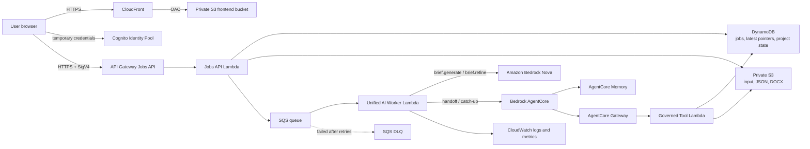

# PilarPrep Team Practice Packet

Use this packet to rehearse the 15-minute demo and prepare for judge questions, especially from a senior AWS Principal Solutions Architect. The goal is not to memorize every line. The goal is for every presenter to understand the story, the tradeoffs, and the AWS reasoning well enough to answer naturally.

## 1. Executive Summary

PilarPrep is an AWS-hosted GenAI application that helps sales teams and Solutions Architects prepare for customer meetings. A user enters customer context, ranked AWS Well-Architected priorities, company values, and people involved in the decision. PilarPrep generates a structured pre-meeting packet, lets the team refine one brief tab at a time, saves the latest approved output, and creates follow-on handoff and catch-up guidance for delivery teams and new project members.

The real problem is the handoff gap between sales, Solutions Architects, and implementation teams. Important context often lives in notes, memory, and Slack threads. PilarPrep turns that context into a repeatable AWS-backed workflow: prepare, refine, approve, hand off, and catch up.

Who it helps:
- Sales teams who need a better customer-specific point of view.
- Solutions Architects who need stronger discovery questions and technical framing.
- Delivery teams who need the "why", risks, owners, and next steps after the meeting.
- New project members who need to catch up without asking the same questions again.

Why it matters:
- Reduces manual prep time.
- Improves meeting quality.
- Keeps technical and business context aligned.
- Creates durable handoff artifacts instead of disposable meeting notes.
- Demonstrates practical GenAI on AWS with security, cost, and operations in mind.

## 2. 15-Minute Demo Runbook

| Time | Speaker | Screen | What to Say |
| --- | --- | --- | --- |
| 0:00-1:00 | Product lead | PilarPrep home/intake | "PilarPrep bridges the gap between sales discovery and SA delivery by creating customer-specific briefs and handoff context." |
| 1:00-2:15 | Product lead | Scenario selector | Introduce BlueMesa Payments or Apex Mutual as the realistic customer scenario. Frame the business problem before touching architecture. |
| 2:15-4:00 | Demo driver | Intake page | Show customer context, company values, ranked pillars, decision-makers, and stakeholders. Point out that inputs are not just form fields; they shape the prompt and project memory. |
| 4:00-5:30 | Demo driver | Generate action | Generate the AI brief. Keep talking while it runs: "The app creates a durable job, queues it, and processes with Bedrock." |
| 5:30-7:30 | SA speaker | Brief tabs | Walk through business case, technical brief, objections, and meeting plan. Emphasize actual questions and business-to-technical alignment. |
| 7:30-9:00 | Demo driver | Refinement panel | Apply targeted feedback to one tab. Explain that the selected tab is regenerated fully, while non-target tabs are preserved. |
| 9:00-10:15 | Demo driver | Approval area | Approve the packet and show saved/latest output. Explain latest-only JSON/DOCX persistence. |
| 10:15-12:00 | GenAI speaker | Handoff | Generate the handoff. Explain why AgentCore is used for follow-on project reasoning and governed tool access. |
| 12:00-13:15 | Demo driver | Catch-up | Show role-aware catch-up. "A new SA or exec can ask what changed and what matters without re-reading everything." |
| 13:15-14:15 | AWS architecture speaker | Architecture diagram or slide | Explain CloudFront, API Gateway, Cognito IAM auth, SQS, Lambda, Bedrock, AgentCore, DynamoDB, S3, and CloudWatch in one clear flow. |
| 14:15-15:00 | Closing speaker | Final packet or app | Summarize value, AWS services used, production path, and why the project is more than a prompt demo. |

Avoid spending too much time on:
- Model internals.
- Every UI field.
- Exact pricing numbers unless asked.
- Reading generated text line by line.
- Explaining old architecture paths or retired code.

Best transition line:
"Now that we have a customer-ready packet, the important question is what happens after the meeting. That is where the handoff and catch-up loop matters."

## 3. Demo Story

Recommended demo customer: BlueMesa Payments.

Business case summary:
BlueMesa Payments is modernizing a high-trust payments platform after acquisitions created fragmented systems, brittle overnight settlement jobs, and inconsistent observability. Executives want faster product launches, but risk and compliance teams will not approve migration work unless recovery, rollback, PCI evidence, and customer-impact controls are clear.

Customer pain:
- Modernization pressure is high, but a production incident would damage merchant trust.
- Current systems mix on-prem, cloud, and acquired platforms.
- Settlement reliability and reporting delays affect customer experience.
- Compliance and risk teams need evidence before approving migration waves.
- Engineering needs a phased AWS plan that does not create uncontrolled blast radius.

Sales and SA alignment problem:
Sales may lead with business value, while the SA may focus on architecture. Without a shared brief, the team can miss the actual approval blockers: risk acceptance, proof of recovery, owner clarity, and board-level confidence.

How PilarPrep improves the workflow:
- Forces the team to rank priorities before the meeting.
- Converts company values and stakeholder notes into tailored discovery questions.
- Produces both business and technical framing.
- Lets the team refine specific brief sections when assumptions change.
- Saves the latest approved packet so follow-on teams use the same source of truth.
- Uses AgentCore for handoff and catch-up, not just one-time content generation.

What judges should notice:
- The app is solving a real pre-sales workflow, not generating generic text.
- The AWS architecture is serverless, low-cost, and practical.
- The GenAI workflow has boundaries: structured inputs, targeted refinement, guardrails, validation, and scoped data access.
- The handoff loop turns meeting prep into reusable project context.

## 4. Architecture Explanation

Plain-English version:
PilarPrep is a web app delivered through CloudFront. The browser gets short-lived AWS credentials, signs requests with IAM, and sends jobs to an API. The API stores job context, places work on SQS, and returns quickly. A worker processes the job using Bedrock for brief generation or AgentCore for handoff and catch-up. Results are stored in private S3 and tracked in DynamoDB.

Technical version:
React/Vite static assets are hosted in a private S3 bucket behind CloudFront with HTTPS. Users obtain Cognito Identity Pool credentials and SigV4-sign requests to an IAM-authorized API Gateway HTTP API. The Jobs API Lambda validates scope, writes a DynamoDB job record, stores larger request input in S3, and sends a pointer-only message to an encrypted SQS queue. A unified AI Worker Lambda consumes the queue, routes `brief.generate` and `brief.refine` to Amazon Bedrock Nova, and routes `handoff.generate` and `catchup.generate` to Bedrock AgentCore. DynamoDB stores job state, latest pointers, approval metadata, client directory records, and project state. S3 stores latest JSON and DOCX artifacts.

Request flow: brief generation
1. User fills out context and clicks generate.
2. Browser signs `POST /jobs` with Cognito IAM credentials.
3. API Gateway authorizes with IAM.
4. Jobs API Lambda validates client/project scope.
5. Lambda writes job status to DynamoDB and larger input to S3.
6. Lambda sends a pointer message to SQS.
7. Worker Lambda consumes the message.
8. Worker invokes Bedrock Nova with structured prompt and guardrail.
9. Worker validates/normalizes output.
10. Worker writes latest JSON/DOCX artifact to S3 and metadata to DynamoDB.
11. Browser polls `GET /jobs/{jobId}` until complete.

Request flow: refinement
1. User selects one brief tab and feedback.
2. Job is created for `brief.refine`.
3. Worker regenerates the complete selected tab from authoritative inputs and feedback.
4. Non-target tabs are preserved exactly.
5. Approval becomes stale because the packet changed.
6. UI can show clean copy or highlighted changes.

Request flow: handoff and catch-up
1. User approves the packet.
2. Handoff job invokes AgentCore.
3. AgentCore uses governed tools to read the latest approved packet and project state.
4. Handoff can update project state with decisions, risks, actions, owners, and next steps.
5. Catch-up is read-only and returns role-aware guidance grounded in the latest approved packet.

Where data is stored:
- S3: latest JSON and DOCX artifacts, plus short-lived job input payloads.
- DynamoDB: jobs, latest pointers, client records, approval metadata, idempotency, and project state.
- AgentCore Memory: short-term project/session continuity.

Where the model is not stored:
The foundation model is managed by Amazon Bedrock. PilarPrep stores configuration, prompts, customer context, artifacts, and project memory. It does not store a customer-specific model binary in S3.

## 5. AWS Service Deep Dive

| Service | Why We Used It | Role | Judge May Ask | Strong Answer |
| --- | --- | --- | --- | --- |
| CloudFront | Secure, global HTTPS delivery | Public entry point for React app | Can users bypass it? | No anonymous direct S3 access is blocked; CloudFront uses Origin Access Control. |
| S3 | Cheap object storage | Static frontend origin and latest JSON/DOCX artifacts | Why not store everything in DynamoDB? | Documents fit S3 better; DynamoDB tracks metadata and access patterns. |
| API Gateway | Managed API entry | Receives signed job and artifact requests | Why HTTP API? | Lower cost and enough features for IAM auth and simple routes. |
| Cognito Identity Pool | Short-lived AWS credentials | Lets browser SigV4-sign requests without API keys | Is this production auth? | Demo uses a controlled identity; production should use user auth or federation. |
| IAM | Authorization boundary | Scopes browser, API, Lambda, worker, and tool access | Why no API keys? | IAM gives short-lived, auditable AWS authorization. API keys identify apps, not users or tenants. |
| Lambda | Serverless compute | Jobs API, worker, and governed tool functions | What about cold starts? | Acceptable for demo; provisioned concurrency or warming can be added for production-critical latency. |
| SQS | Durable async buffer | Decouples API from long AI calls | Why not direct Lambda invoke? | SQS gives retries, buffering, DLQ, and safer timeout handling. |
| DLQ | Failure isolation | Captures jobs that fail repeated processing | What do you do with DLQ messages? | Alarm, inspect trace/job ID, fix root cause, then replay if safe. |
| DynamoDB | Low-latency state | Jobs, latest pointers, idempotency, project state | Why one table? | The access patterns share tenant/client/project scope; one table keeps operations simple and cheap. |
| Bedrock | Managed GenAI inference | Brief generation and refinement | Why not SageMaker? | We need managed foundation model inference, not custom model training/hosting. |
| AgentCore | Agentic follow-on workflow | Handoff and catch-up with memory and governed tools | Why not only Bedrock? | AgentCore adds memory, tool governance, and scoped project-state workflows. |
| Guardrails | Safety control | Applies model safety filters | Does it prevent all hallucinations? | No. It is one layer alongside grounding, schema validation, retries, and source constraints. |
| CloudWatch | Operations visibility | Logs, metrics, alarms, dashboards | How do you troubleshoot? | Start with job ID, API logs, worker logs, queue/DLQ metrics, then Bedrock/AgentCore result metadata. |

## 6. Security Talking Points

The S3 frontend bucket is private because S3 should not be the public access path. CloudFront is the public entry point and reads S3 through Origin Access Control. This allows HTTPS, caching, security headers, and a single controlled distribution.

API keys were avoided because an API key in a browser is not a strong security boundary. PilarPrep uses Cognito Identity Pool credentials and SigV4 so requests are signed with temporary AWS credentials. API Gateway can enforce IAM authorization before Lambda receives the request.

Customer/client scope is enforced server-side. The browser sends a client ID, but backend validators decide whether that identity can access that client and project. AgentCore tools also revalidate signed scope before reading S3 or DynamoDB.

Demo-only choices to call out honestly:
- The public demo identity is intentionally simplified for hackathon sharing.
- Production should use Cognito User Pools, IAM Identity Center, or enterprise OIDC/SAML.
- Production should add real tenant assignment claims, stricter WAF rules, access logs, audit history, and stronger approval records.

Multi-tenant production path:
- Add authenticated users and tenant claims.
- Store every artifact under tenant/client/project prefixes.
- Enforce tenant claims in IAM and application validators.
- Keep approved packet versions immutable.
- Add audit logs for approvals, downloads, and model-generated changes.

## 7. Well-Architected Review

| Pillar | Current Strength | Current Compromise | Production Improvement |
| --- | --- | --- | --- |
| Operational Excellence | Serverless, CloudWatch logs, dashboards, repeatable scripts | Some demo flows still rely on manual rehearsal discipline | Add runbooks, alarms with notifications, CI/CD gates, and automated rollback |
| Security | Private S3, CloudFront, IAM API auth, scoped tools, guardrails | Demo identity is intentionally broad for public access | Replace demo identity with real auth, tenant claims, WAF blocking, CloudTrail data events |
| Reliability | SQS async jobs, DLQ, managed services, latest artifact pointers | Long AI calls can still fail or time out | Add replay tooling, stronger idempotency dashboards, Step Functions if workflows grow |
| Performance Efficiency | Static frontend, serverless scaling, queued workers | AI latency is model-dependent | Tune prompts, use smaller models for practice, add provisioned concurrency if needed |
| Cost Optimization | On-demand services, no always-on model endpoint, latest-only artifacts | Bedrock/AgentCore token usage can grow | Add quotas, per-client usage caps, model selection, and budget alarms |
| Sustainability | Serverless and latest-only storage reduce idle resources | Repeated demo generations still consume model tokens | Cache approved examples, use Micro for rehearsals, delete unused resources after demo |

## 8. GenAI Explanation

Why Bedrock instead of SageMaker:
Bedrock is the right fit because PilarPrep needs managed foundation model inference. We are not training or hosting a custom model. SageMaker would make sense if we needed custom training, fine-tuning workflows, or a dedicated hosted model endpoint.

Why Nova Pro or Nova Micro:
Nova Micro is inexpensive and useful for repeated rehearsals. Nova Pro gives stronger reasoning and more detailed output for final-quality demo runs. The app is wired so model selection can be changed without redesigning the architecture.

Why AgentCore for handoff/catch-up:
Brief generation is bounded: one request, one structured output. Handoff and catch-up are workflow-oriented: read latest approved packet, consult project state, remember session context, call governed tools, and produce role-aware answers. AgentCore is justified there.

Direct model call vs agent workflow:
- Direct Bedrock call: best for structured content generation and refinement.
- AgentCore: best when the model needs tools, memory, state validation, and scoped project workflows.

How hallucination risk is reduced:
- Inputs are structured.
- Prompts include customer context, values, ranked pillars, and people context.
- Outputs follow schema contracts.
- Guardrails are applied.
- Backend validates completeness and contradictions.
- Refinement treats explicit feedback as authoritative.
- AgentCore tools only expose scoped, approved project data.

What Guardrails do and do not solve:
Guardrails help with safety and policy constraints. They do not guarantee business accuracy, replace source grounding, or prove an architecture is correct. PilarPrep still needs validation, review, approval, and human judgment.

## 9. Data Lifecycle

S3 stores:
- Latest generated packet JSON.
- Latest DOCX packet.
- Short-lived job input payloads when the request is too large for a queue message.

DynamoDB stores:
- Job status and polling state.
- Client directory records.
- Latest packet pointers.
- Approval metadata.
- Idempotency records.
- Project state such as decisions, risks, actions, owners, milestones, and open questions.

"Latest only" means the app replaces the current saved artifact for that client rather than building an unbounded archive of old versions. This keeps demo storage simple and cheap. For production, approved versions should be immutable and retained for audit.

Approval state:
The UI marks when a packet is approved and when refinement makes approval stale. A production version should make approval a durable backend transaction with approver, timestamp, packet hash, and version ID.

Catch-up:
Catch-up reads the latest approved packet and current project state. It should not overwrite the brief or mutate project state. Its purpose is to help a new SA, exec, or delivery member understand the current state quickly.

## 10. Cost Explanation

Fixed or fixed-ish costs:
- Any configured WAF, custom metrics, alarms, dashboards, or secrets may create small fixed charges depending on setup and free tier eligibility.

Usage-based costs:
- Bedrock tokens.
- AgentCore runtime, memory, and gateway usage.
- Lambda requests and duration.
- API Gateway requests.
- SQS requests.
- DynamoDB reads/writes/storage.
- S3 storage and requests.
- CloudFront requests and data transfer.
- CloudWatch logs and metrics.

Why the demo is low cost:
The architecture has no always-on EC2 instances, NAT Gateway, RDS database, provisioned model endpoint, or scheduled batch process. It is request-driven. Most cost comes from model usage during generation, refinement, handoff, and catch-up.

How to keep spend low:
- Use Nova Micro for rehearsals.
- Use Nova Pro for final demo-quality runs.
- Limit daily demo generations.
- Keep latest-only artifacts.
- Use on-demand DynamoDB at demo traffic.
- Keep log retention short.
- Watch Bedrock token usage.
- Delete or disable resources after the event if not needed.

Pricing note:
Before presenting, check current AWS pricing pages or AWS Pricing Calculator. Do not quote stale token prices as fact.

## 11. Lene-Style Judge Questions

1. Why is this not just a prompt wrapper?
Answer: The value is the workflow: structured inputs, targeted refinement, approval, latest artifacts, project handoff, catch-up, scoped storage, and AWS-native operations.

2. Why Bedrock instead of SageMaker?
Answer: We need managed FM inference, not custom training or model hosting. Bedrock reduces operational overhead and keeps the app serverless.

3. Why AgentCore instead of only Lambda plus Bedrock?
Answer: Lambda plus Bedrock is enough for bounded brief generation. AgentCore adds governed tools, memory, and project-state workflows for handoff and catch-up.

4. Why SQS?
Answer: AI calls can take longer than a normal request. SQS decouples the API from the worker, adds retries, buffers bursts, and gives us a DLQ.

5. Why one DynamoDB table?
Answer: The primary access patterns are scoped by tenant/client/project and job. One table keeps state, pointers, and idempotency together while staying cheap and operationally simple.

6. What is stored in S3?
Answer: Latest JSON/DOCX artifacts and temporary large job inputs. The model itself is not stored in S3.

7. Can users access the frontend S3 bucket directly?
Answer: No anonymous direct bucket access is blocked. Users access the app through CloudFront, which uses Origin Access Control.

8. Is the frontend public?
Answer: The static app is public through CloudFront for demo sharing. Protected data and API actions are controlled through IAM-signed requests and backend scope validation.

9. Why no API key?
Answer: API keys in browsers are not strong auth. Cognito Identity Pool plus SigV4 gives temporary AWS credentials and IAM authorization.

10. What is demo-only about auth?
Answer: The demo identity is simplified. Production should use authenticated users, tenant claims, and enterprise federation.

11. How is customer data isolated?
Answer: Server-side validators enforce client/project scope, and AgentCore tools revalidate scope before S3 or DynamoDB access. Production should add authenticated tenant claims.

12. What prevents one client from seeing another client's packet?
Answer: API scope checks, DynamoDB/S3 key prefixes, and tool-level validation. The browser cannot be trusted alone.

13. What happens if SQS delivers a message twice?
Answer: Workers use job state and idempotency records so duplicate delivery should not duplicate artifacts or project updates.

14. What happens if the model fails?
Answer: The job fails clearly or retries according to the pipeline. The app should not silently pretend demo content is live output.

15. What happens if AgentCore fails?
Answer: The system can surface failure or use a clearly marked fallback. The approved brief remains intact.

16. How are hallucinations reduced?
Answer: Structured context, prompt contracts, guardrails, schema validation, contradiction checks, and human approval.

17. Do Guardrails prove the output is correct?
Answer: No. They reduce safety risk but do not replace validation, grounding, or human review.

18. How does refinement avoid changing the wrong tab?
Answer: The request includes a refinement target. Backend merge logic preserves non-target tabs and validates the changed target.

19. What if feedback says the customer is already on AWS?
Answer: That feedback becomes authoritative for the selected tab. Contradictory on-prem migration claims should be removed during full-tab regeneration.

20. Why save DOCX?
Answer: Sales and SA teams often need editable artifacts they can share, review, and attach to normal workflows.

21. Why latest-only storage?
Answer: For demo simplicity and low cost. Production should retain immutable approved versions for audit.

22. Is DynamoDB better than Postgres here?
Answer: For job status, latest pointers, idempotency, and scoped project state, DynamoDB is simple, serverless, and cheap. Relational reporting could be added later if needed.

23. How would this scale?
Answer: CloudFront scales static delivery, API Gateway and Lambda scale per request, SQS absorbs bursts, DynamoDB on-demand handles traffic growth, and model limits become the main scaling constraint.

24. What are the main bottlenecks?
Answer: Model latency, AgentCore runtime latency, Lambda timeout, and Bedrock quotas.

25. How do you observe failures?
Answer: Use job ID and trace ID through API logs, worker logs, DynamoDB job records, SQS/DLQ metrics, and Bedrock/AgentCore response metadata.

26. Why not Step Functions?
Answer: SQS plus one worker is simpler for this demo. Step Functions would be useful if the workflow grows into many explicit states, approvals, and branches.

27. Is there a VPC?
Answer: No VPC is needed for this demo because dependencies are AWS public service endpoints. Avoiding NAT Gateway also keeps cost down.

28. What is the biggest production risk?
Answer: Demo-grade auth and approval/audit depth. Production needs real user identity, tenant claims, immutable approval records, and stronger audit history.

29. How much does one generation cost?
Answer: It depends on input/output tokens, model choice, retries, and AgentCore/tool usage. We would quote current AWS pricing, not a stale estimate.

30. What would you improve with two more weeks?
Answer: Real auth, immutable approvals, retained versions, stronger observability, rate limits, production WAF rules, and a richer admin/client access model.

31. Why use company values?
Answer: Sales teams need messaging aligned to how the customer describes itself. Values help the model frame outcomes and questions in the customer's language.

32. Why support stakeholders beyond decision-makers?
Answer: Many projects are influenced by security, finance, legal, operations, and application owners even when they are not final approvers.

33. What is the business value?
Answer: Faster prep, better discovery, fewer handoff gaps, and more consistent customer-facing conversations.

34. What makes this recruiter-worthy?
Answer: It combines a real workflow, AWS serverless architecture, GenAI integration, security reasoning, and a live demo with production tradeoffs.

35. What would you shut down after the demo?
Answer: Any nonessential demo resources, old stacks, unused runtimes, extra logs, and high-cost model usage.

## 12. Speaker Cheat Sheets

Product / problem statement speaker:
- Core message: PilarPrep solves the sales-to-SA handoff gap.
- Talking points: real pre-sales workflow; customer-specific context; reusable project memory.
- Likely questions: Who uses it? Why does it matter? What is the measurable value?
- Short answers: Sales, SAs, and delivery teams use it; it reduces prep and rework; value shows up in faster alignment and better discovery.

Demo driver:
- Core message: The app is simple to use but backed by a real AWS workflow.
- Talking points: intake context; generate/refine/approve; handoff/catch-up.
- Likely questions: What changed after feedback? Where is output saved? Can users catch up later?
- Short answers: The selected tab is regenerated; latest JSON/DOCX goes to S3; catch-up reads the latest approved packet.

AWS architecture speaker:
- Core message: Serverless, async, secure-by-default demo architecture.
- Talking points: CloudFront/private S3; IAM API with Cognito credentials; SQS to worker to Bedrock/AgentCore.
- Likely questions: Why SQS? Why one table? Can S3 be bypassed?
- Short answers: SQS handles long jobs; one table matches access patterns; direct S3 public access is blocked.

GenAI speaker:
- Core message: Bedrock handles bounded generation; AgentCore handles follow-on workflows.
- Talking points: Nova model selection; targeted refinement; governed tools and memory.
- Likely questions: Why AgentCore? What about hallucination? Where is the model stored?
- Short answers: AgentCore adds tool/memory orchestration; hallucination is reduced by grounding and validation; the model is managed by Bedrock.

Security / Well-Architected speaker:
- Core message: The demo uses real AWS controls and has a clear production path.
- Talking points: IAM/SigV4; private S3; scoped backend validation.
- Likely questions: Is auth production-ready? How is data isolated? What is biggest risk?
- Short answers: Demo auth is simplified; backend scope checks isolate data; production needs real user identity and immutable audit records.

Closing speaker:
- Core message: PilarPrep is practical, AWS-native, and demo-ready.
- Talking points: real customer workflow; live AWS architecture; clear next steps.
- Likely questions: What would you build next? What did you learn? Why should this win?
- Short answers: Add production auth and audit; learned how to combine GenAI with AWS operations; it solves a real workflow with credible architecture.

## 13. Red-Team Review

Demo-grade areas:
- Public demo identity is not production tenant auth.
- Latest-only storage is good for cost but not enough for audit history.
- Model output quality depends on prompts, context, and selected model.
- Long AI calls can still feel slow if Bedrock or AgentCore latency spikes.
- The team needs a backup artifact in case live generation is slow.

Questions that may expose gaps:
- "How do you prove an approved packet cannot be overwritten?"
- "How do you map real users to real customers?"
- "How would you support regulated customer data?"
- "What is the rollback plan if AgentCore fails?"
- "How do you measure output quality?"

Honest answers that keep credibility:
- "For the hackathon, we optimized for a working end-to-end AWS demo. For production, the first upgrades are real identity, immutable approvals, audit logs, and stricter tenant isolation."
- "We intentionally kept the architecture serverless and low-cost. We would add complexity only where the access patterns demand it."
- "The model is not the source of truth. Approved packets, project state, and human review are the source of truth."

Demo failure backup:
- If live generation is slow, use a previously approved packet and explain the async job pipeline.
- If AgentCore is slow, show the saved handoff/catch-up output and explain the runtime path.
- If auth fails, show architecture slides and saved artifacts while one person investigates the browser/API state.

## 14. Final Presentation Script

Opening:
"We built PilarPrep to solve a problem that shows up in almost every customer-facing technical team: sales, Solutions Architects, and delivery teams often work from different context. A lot of meeting prep is manual, and after the meeting, the important decisions and risks are easy to lose. PilarPrep turns that workflow into an AWS-hosted GenAI application."

Problem:
"The target user is a Solutions Architect or sales engineer preparing for a customer meeting. They need business context, technical assumptions, good discovery questions, and a clean handoff after the conversation. Our goal was not to generate generic text. Our goal was to create a repeatable workflow from preparation to approval to project follow-through."

Scenario:
"For the demo, we are using BlueMesa Payments. They are modernizing a payments platform after acquisitions created fragmented systems and brittle settlement processes. The business wants faster delivery, but risk and compliance teams need proof around rollback, recovery, PCI evidence, and customer impact."

Intake:
"On the intake page, we capture the customer, industry, meeting type, company size, ranked AWS pillars, known context, company values, and the people involved. We split people into decision-makers and stakeholders because not everyone has final approval authority, but many people can influence whether the project moves forward."

Generation:
"When we generate the packet, the browser signs the request with temporary AWS credentials. API Gateway enforces IAM authorization. A Jobs Lambda validates scope, creates a DynamoDB job, stores large input in S3, and puts a pointer message on SQS. The worker consumes that message and uses Amazon Bedrock Nova to generate the brief."

Brief review:
"The output is organized for how an SA would actually prepare: business case, technical conversation, objections, meeting plan, and handoff context. We want the team to restate the business scenario, align on outcomes, and then ask better questions."

Refinement:
"If the team spots a bad assumption, refinement is targeted. For example, if we say the customer is already on AWS, the selected tab is regenerated from that corrected fact. The app should not keep stale on-prem assumptions in that tab, and it should not modify unrelated tabs."

Approval and save:
"Once the packet is ready, it is approved and saved as the latest JSON and DOCX artifact in private S3, with metadata tracked in DynamoDB. For the demo we use latest-only storage to keep it simple and low-cost. In production we would retain immutable approved versions for audit."

Handoff:
"The second loop is the follow-on project model. This is where AgentCore adds value. Bedrock is great for generating a bounded brief. AgentCore is better for handoff and catch-up because it can use memory and governed tools to read the approved packet and project state without giving the model open database or S3 access."

Catch-up:
"Now a new SA, executive sponsor, or delivery team member can catch up from the latest approved packet. The answer is role-aware, but it is grounded in the same approved project context."

Architecture:
"The architecture is serverless and AWS-native: React on private S3 behind CloudFront, Cognito Identity Pool for temporary credentials, IAM-authorized API Gateway, Lambda, SQS with DLQ, Bedrock, AgentCore, DynamoDB, S3 artifacts, Guardrails, and CloudWatch. The model itself is not stored by us; Bedrock manages the foundation model. We store customer context, prompts, artifacts, and project state."

Security:
"For demo sharing, the frontend is public through CloudFront, but the S3 bucket is private and direct bucket access is blocked. API calls use IAM-signed requests instead of browser API keys. The demo identity is intentionally simple, and the production path is real user authentication with tenant claims and stricter audit controls."

Well-Architected:
"The design is cost-conscious because there are no always-on servers or hosted model endpoints. Reliability comes from SQS and managed services. Security comes from private buckets, IAM, scoped validation, and Guardrails. The main production improvements would be stronger identity, immutable approvals, access logs, and deeper operational alarms."

Close:
"PilarPrep is useful because it turns GenAI into a real workflow. It prepares the meeting, improves the questions, captures the approved context, and helps the next person catch up. It is not production-finished, but it has a credible AWS architecture and a clear path from hackathon demo to enterprise-ready tool."

## Quick Architecture Diagram

