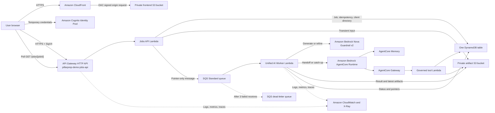
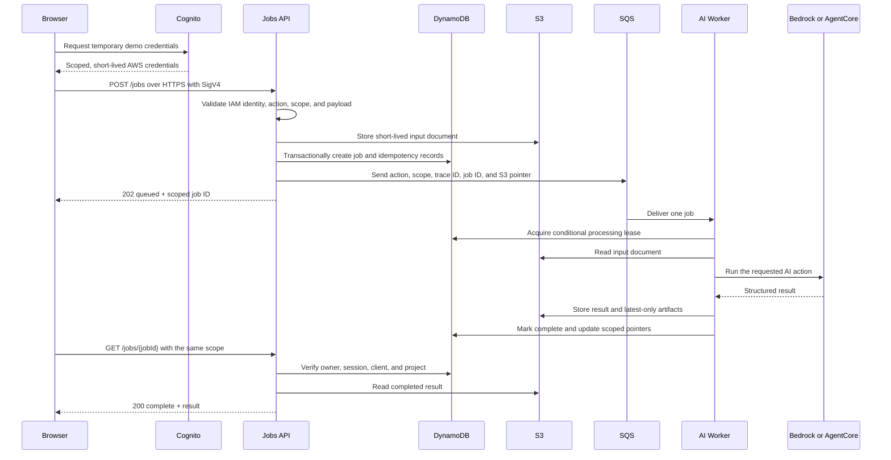

# PilarPrep Unified Jobs Architecture

Status: **Historical live baseline verified in `us-east-1` on 2026-08-13.**
This document records the unified-jobs cutover before the current identity,
edge, immutable-approval, tenant-scoped RAG, quota, and DLQ hardening work.
Use `docs/portfolio-architecture.md` as the canonical target architecture.
The hardened branch is not considered live until its release verification
report is complete.

## Executive summary

PilarPrep is a request-driven serverless application. CloudFront serves the
React application from a private S3 origin. A demo user receives short-lived
AWS credentials from Cognito and SigV4-signs calls to one IAM-authorized Jobs
API. The API validates tenant and project scope, writes a job record and a
short-lived input object, and sends a pointer-only message to SQS. One worker
then routes the job to Amazon Bedrock for brief work or to AgentCore for
handoff and catch-up work.

The design uses one physical DynamoDB table for job status, latest pointers,
approval metadata, project state, client directory entries, and idempotency.
One private S3 artifact bucket stores transient job documents and latest-only
JSON/DOCX outputs. There is no PilarPrep model stored in S3: AWS manages Nova
inside Bedrock, while PilarPrep stores prompts, approved context, state, and
generated artifacts.

## Last verified live inventory (2026-08-13)

| Layer | Live resource |
|---|---|
| Public application | `https://pilarprep.app` |
| CloudFront | Distribution `E3N3M69BO7PCI9` with alias `pilarprep.app` |
| Frontend origin | `pillarprep-frontend-386807258431-us-east-1` |
| Jobs API | API `kcod9pw1j7` at `https://kcod9pw1j7.execute-api.us-east-1.amazonaws.com` |
| Jobs API Lambda | `pillarprep-demo-jobs-api` |
| Unified worker | `pillarprep-demo-ai-worker` |
| Main queue | `pillarprep-demo-ai-jobs` |
| Dead-letter queue | `pillarprep-demo-ai-jobs-dlq` |
| DynamoDB table | `pillarprep-bedrock-ProjectStateTable-1TVIRZ6WP8KRI` |
| Artifact bucket | `pillarprep-bedrock-briefartifactsbucket-nwvlt6tay5zk` |
| Cognito Identity Pool | `us-east-1:51a31152-80e4-453f-b17e-5077109376fa` |
| Bedrock Guardrail | `4n4bcsibf83u`, version `2` |
| AgentCore Runtime | `PilarPrepProjectAgent-FjGV7rBEmT` |
| AgentCore Memory | `PilarPrepProjectMemory-YInIzDEv62` |
| AgentCore Gateway | `pillarprep-demo-project-gateway-zafwhugtiw` |
| Governed tool Lambda | `pillarprep-demo-agent-tools` |
| Operations dashboard | `pillarprep-demo-jobs-pipeline` |

## Live architecture



## Request lifecycle



## Active request contract

All production calls use HTTPS and AWS IAM authorization.

| Route | Purpose | Result |
|---|---|---|
| `POST /jobs` | Validate and enqueue an AI action | `202` with a scoped job ID |
| `GET /jobs/{jobId}` | Poll queued, running, complete, or failed state | `202` while active, `200` when terminal |
| `GET /clients` | List clients allowed for the caller | Latest-approved and handoff summary |
| `GET /clients/{clientId}/latest` | Read the latest approved packet | Approved server-side packet only |
| `GET /artifacts/{artifactType}` | Download a scoped latest artifact | JSON or DOCX response |

Supported actions:

| Action | Processing path | Write behavior |
|---|---|---|
| `brief.generate` | Worker to Bedrock Nova | Creates a complete draft packet |
| `brief.refine` | Worker to Bedrock Nova | Regenerates only the selected tab; invalidates approval |
| `handoff.generate` | Worker to AgentCore | Updates project state and latest handoff |
| `catchup.generate` | Worker to AgentCore | Read-only; project version must remain unchanged |

The hosted frontend has one live transport: the IAM-signed Jobs API. Its
production bundle contains the Jobs API URL, AWS Region, and Cognito Identity
Pool ID. It has no legacy Brief or Agent API variables. A hosted failure is
surfaced to the user and never replaced by deterministic demo content.

## SQS and worker configuration

| Setting | Live design |
|---|---|
| Queue type | SQS Standard |
| Encryption | Customer-managed KMS key shared with PilarPrep data stores |
| Long polling | 20 seconds |
| Visibility timeout | 3,600 seconds |
| Queue retention | 1 day |
| Maximum receives | 3, then DLQ |
| DLQ retention | 14 days |
| Lambda batch size | 1 |
| Partial batch response | Enabled |
| Worker maximum concurrency | 2 |
| Worker runtime | Python 3.12 on arm64 |
| Worker timeout | 600 seconds |
| AgentCore SDK read deadline | 300 seconds |
| Caught-failure redelivery | 5 seconds |

SQS messages contain routing and scope fields plus an S3 input pointer. They do
not contain full briefs, customer notes, or DOCX content. Conditional DynamoDB
writes provide idempotency and processing leases because SQS Standard delivery
is at least once. A caught worker exception resets that delivery's visibility
to five seconds; the queue keeps its 3,600-second visibility timeout for work
that is still executing or is terminated before application cleanup can run.

## One-table DynamoDB design

The physical table uses `projectId` as the partition key and `sortKey` as the
sort key. It is on-demand, encrypted with the customer-managed PilarPrep KMS
key, protected by deletion protection and point-in-time recovery, and uses TTL
on `expiresAt`. No second jobs table or GSI is required for current access.

| Entity | Partition key | Sort key | Purpose |
|---|---|---|---|
| Job | `TENANT#t|CLIENT#c|PROJECT#p` | `JOB#jobId` | Status, owner, session, trace, retries, pointers, TTL |
| Job idempotency | Same project key | `IDEMPOTENCY#JOB#key` | Prevent duplicate enqueue |
| Action idempotency | Same project key | `IDEMPOTENCY#ACTION#key` | Prevent duplicate artifacts or state writes |
| Latest brief | Same project key | `BRIEF#LATEST` | Draft/approved version and latest S3 pointers |
| Latest handoff | Same project key | `HANDOFF#LATEST` | Latest handoff pointer and source brief version |
| Project state | Same project key | `PROJECT#STATE` | Decisions, risks, actions, owners, milestones, assumptions |
| Client directory | `TENANT#t` | `CLIENT#c` | Authorized catch-up list and latest pointers |

Job records expire after one hour. Job idempotency and action idempotency
records live for roughly one week. Durable latest metadata and project state do
not use TTL.

## S3 layout and lifecycle

The shared artifact bucket blocks every form of public access, requires TLS,
uses the customer-managed PilarPrep KMS key, and has versioning enabled.

```text
jobs/{tenant}/{client}/{project}/{jobId}/input.json
jobs/{tenant}/{client}/{project}/{jobId}/result.json
tenants/{tenant}/clients/{client}/projects/{project}/brief/draft/latest.json
tenants/{tenant}/clients/{client}/projects/{project}/brief/draft/latest.docx
tenants/{tenant}/clients/{client}/projects/{project}/brief/approved/v000001/packet.json
tenants/{tenant}/clients/{client}/projects/{project}/brief/approved/v000001/packet.docx
tenants/{tenant}/clients/{client}/projects/{project}/handoff/latest.json
tenants/{tenant}/clients/{client}/projects/{project}/handoff/latest.docx
```

Objects under `jobs/` expire after one day. Draft and handoff latest objects are
replaceable current working artifacts. Approved brief JSON/DOCX pairs use an
immutable versioned key, while `BRIEF#LATEST` selects the current approval.

## Security and HTTPS controls

- CloudFront redirects HTTP viewers to HTTPS and reads S3 through Origin Access
  Control. S3 website hosting is disabled and direct object requests return
  `403`.
- The CloudFront managed security-headers policy supplies HSTS, frame, referrer,
  XSS, and content-type protections. The static document supplies the CSP. The
  CloudFront Free plan does not permit the custom response-headers policy that
  would otherwise move CSP into an HTTP header.
- The Jobs API is an API Gateway HTTP API with AWS IAM as its default
  authorizer. CORS permits only `https://pilarprep.app` and the current
  CloudFront distribution origin.
- API Gateway throttles at 4 requests per second with a burst of 8.
- The browser role can invoke only the PilarPrep Jobs API. Worker IAM grants
  access only to the configured queue, table, artifact prefixes, Bedrock model
  ARNs, Guardrail, scope secret, and AgentCore Runtime.
- Tenant, client, project, user, session, and job ownership are checked on the
  server. Unauthorized jobs return `404`, avoiding cross-client disclosure.
- The public hackathon demo intentionally uses unauthenticated Cognito Identity
  Pool identities. Production must replace this with authenticated users and
  tenant/client claims; IAM authorization is not the same as user login.

## GenAI behavior

The default generation model is `us.amazon.nova-pro-v1:0`; the lower-cost
alternate is `us.amazon.nova-micro-v1:0`. Bedrock Guardrail `4n4bcsibf83u`
version `2` is applied to Bedrock work. The model receives structured customer
context, ranked pillars, approved stakeholder notes, company values, and the
selected action contract.

Refinement rebuilds the complete selected brief tab. Explicit corrections
supersede old assumptions, the server validates common contradictions, and
non-target tabs must remain deeply equal. Approval becomes stale when a new
refinement version succeeds.

Handoff and catch-up use AgentCore Runtime. The agent can reach project data
only through governed Gateway tools. Handoff may conditionally update project
state and replace the latest handoff. Catch-up reads the latest approved
server-side packet and is rejected if the project-state version changes.

## Operations and cost

The Jobs API and worker use 14-day CloudWatch log groups and active X-Ray
tracing. Alarms cover visible DLQ messages, queue age over five minutes, and
worker errors. The `pillarprep-demo-jobs-pipeline` dashboard shows queue,
API, and worker health.

The design has no always-on compute, VPC, NAT Gateway, provisioned database
capacity, or hosted model endpoint. Bedrock and AgentCore usage are the main
variable costs; Lambda, API Gateway, SQS, DynamoDB, and S3 are very small at
demo traffic. A measured Nova Pro generation reported an application estimate
of about `$0.0149`, and a measured refinement about `$0.0106`; these are
diagnostics, not a billing guarantee. Confirm current pricing on the official
AWS pricing pages before presenting. Low demo volume remains comfortably below
the approximately `$1/day` target.

## Stack ownership and migration status

| Stack | Active responsibility | Rollback-only resources retained |
|---|---|---|
| `pillarprep-frontend` | CloudFront, private frontend bucket, current Jobs API build | None in the browser bundle |
| `pillarprep-jobs` | Jobs HTTP API, Jobs API Lambda, SQS/DLQ, unified worker, alarms, dashboard | None |
| `pillarprep-bedrock` | Artifact bucket, one DynamoDB table, Cognito demo identity, Guardrail | Previous Brief API and direct async Lambdas |
| `pillarprep-agentcore` | Runtime, Memory, Gateway, governed tool Lambda, scope secret | Previous Agent API, router, and worker |

The old API and worker resources are not referenced by the public production
bundle. They remain deployed as a rollback path. Removing their CloudFormation
resources, roles, permissions, and log groups is a separate destructive change
that should happen only after explicit approval and a final retention review.

## Verified live evidence (2026-08-21)

- All four stacks reached `UPDATE_COMPLETE`.
- Unsigned Jobs API request returned `403`.
- Cross-client job polling was rejected without disclosing another client's data.
- Nova Pro produced the complete live briefing packet with no demo fallback.
- Business-case and objection refinements regenerated only their selected tabs.
- The existing-on-AWS correction removed the contradictory on-premises state.
- Approval created immutable packet v3 and advanced the DynamoDB latest pointer.
- Handoff completed through AgentCore and its governed tools.
- Catch-up completed through AgentCore without changing project state.
- The synthetic MP3 progressed through transcription, analysis, and human review.
- The transcript contained 27 segments and produced 7 grounded review items.
- Meeting approval accepted 6 changes, rejected 1, then grounded the handoff.
- Authorized DOCX download returned `200`.
- Direct artifact, evidence, and frontend S3 requests returned `403`.
- `https://pilarprep.app` returned `200`; HTTP redirected with `301`.
- CloudFront emitted CSP, HSTS, referrer, frame, and MIME security headers.
- The deployed bundle used the unified Jobs API and no legacy browser API path.
- The final CloudFront invalidation reached `Completed`.

## Deployment order

```powershell
.\scripts\deploy-aws-backend.ps1 -Region us-east-1 -AllowedOrigin https://pilarprep.app
.\scripts\deploy-agentcore.ps1 -Region us-east-1
.\scripts\deploy-jobs-pipeline.ps1 -Region us-east-1
.\scripts\deploy-aws-frontend.ps1 -Region us-east-1
```

Deploy only with the `PilarPrepHackathonDeployer` assumed role. The scripts
reject AWS account root credentials and reject non-HTTPS deployed origins.
